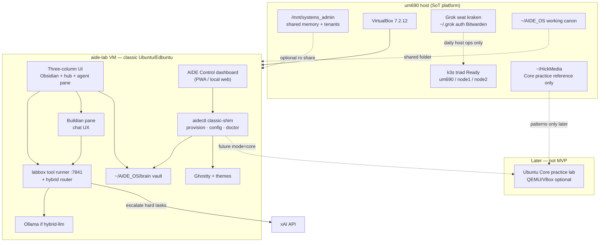
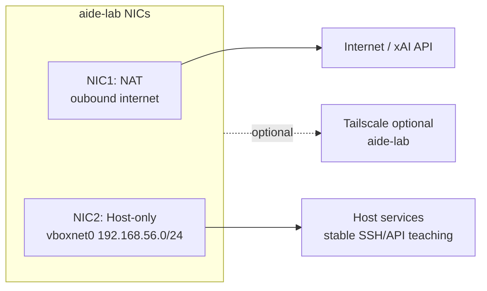
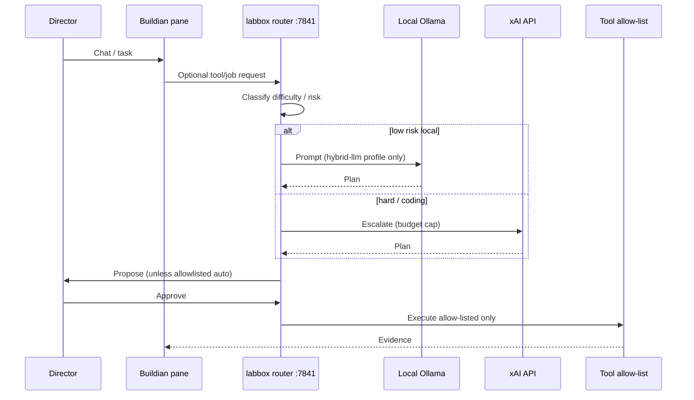

# Design: AIDE_OS Lab-in-a-Box — VirtualBox VM Prototype (um690 SoT)

| Field | Value |
|-------|--------|
| **Title** | AIDE_OS Lab-in-a-Box: VirtualBox VM mirroring um690 as prototype |
| **Author** | Grok (systems architect seat) · Director: Josh |
| **Date** | 2026-08-02 |
| **Status** | **Accepted** (rev. 2026-08-02g — design SoT locked; live vs design drift in footer) |
| **Seat / tree** | `~/AIDE_OS` (education / platform docs) · host `um690` as **kraken** |
| **Primary brief** | `/home/kraken/Documents/notes/grok-build-prompt.md` |
| **Related designs** | `docs/design/2026-07-27-grokaide-electron-education-ui.md`, `2026-07-27-aide-core-aidectl.md`, `2026-07-27-grokaide-obsidian-idee.md` |
| **Product gates** | `docs/PLATFORM.md` · `docs/PRODUCT-SCOPE-AND-EDBUNTU.md` · `docs/NO-SCHOOL-SKU.md` |

---

## Overview

This document specifies an **implementable VirtualBox-based “AIDE_OS lab-in-a-box”** that runs on host **um690** and **faithfully mirrors um690’s layout, seats, storage conventions, and LabNET mental model** as the prototype/reference. The guest is a **personal / bootcamp learning VM** (and portfolio demo), not a district school SKU and not a HickMedia gaming console.

**Proposed solution (MVP):** one well-sized **classic Ubuntu/Edbuntu desktop guest** (**locked day-1 OS** — not Ubuntu Core; promote or rebuild existing *Learn Aide (edubuntu 26.06)* when healthy) that:

1. Emulates the **um690 control-plane seat** (kraken home tree conventions, `aidectl` classic-shim, Obsidian brain vault, Ghostty, hybrid local+xAI agent loop).
2. Surfaces a **three-column dark neon IDE** (notes + project hub + agent pane) matching screenshots already on disk.
3. Exposes a thin **control-plane dashboard** whose *information architecture* is inspired by the xAI console (Dashboard / Keys / Models / Usage / Logs) but **branded AIDE** — never copied as trademarked chrome.
4. Brings up from a powered-off **`golden-mvp` snapshot** to a healthy demo in **≤ 90 minutes** (restore path only — cold first-build is a separate half-day procedure), without nested k3s on day 1 and without starving the live k3s triad on the host.

Host k3s (um690 / node1 / node2) remains the real platform SoT. The VM is a **portable sandbox + interview portfolio artifact** that reuses host trees via shared folders and optional Tailscale, rather than duplicating the full LabNET fleet inside VirtualBox.

---

## Background & Motivation

### Why this exists

From the X.com / Grok conversation (`grok-build-prompt.md`) and live readiness analysis:

- Josh is building toward an **interview-competitive DevOps/SysAdmin portfolio** (Canonical / xAI ops-adjacent / junior Linux roles), with **LFCS** in progress.
- Weekly GrokBuild compute limits make frontier-agent-only iteration expensive; a **local lab-in-a-box** multiplies practice without burning the weekly pool.
- The full vision (shipped IoT kits, Starlink, multi-vendor AI, Ubuntu Core appliance, thin agents on every M93p + VyOS) is multi-year. The conversation’s hard recommendation was: **narrow to a rock-solid bring-up loop first**.
- um690 already has VirtualBox **7.2.12**, prior AIDE learning VMs, Guest property history, and Tailscale peer `um690-test-vm` (offline). Design should **reuse, not invent a second hypervisor stack**.

### Current state (pain points)

| Pain | Evidence on um690 |
|------|-------------------|
| Education product vs platform confusion | Historically mixed; now gated via `PLATFORM.md` / `NO-SCHOOL-SKU.md` |
| No portable demo of the IDE + agent loop | Screenshots exist; no OVA / golden snapshot with documented 90-min bring-up |
| Existing VMs are ad-hoc | *Learn Aide*: 8G RAM / 2 CPUs / ~12G VDI; *Ubuntu Cinnamon*: 8G / 4 CPUs; script-tester VMs clutter tree |
| Nested k3s temptation | Heavy on VirtualBox; host already runs healthy k3s triad — dual cluster is risk without payoff for MVP |
| Brand risk | Pitch used “Grok AIDE_OS”; xAI trademark exposure if public product name embeds Grok |
| Resource contention | Host: 59 GiB RAM, 16 threads, k3s Ready on 3 nodes — VM must leave headroom |

### What already works on host (reuse)

- `~/AIDE_OS` tree: `aidectl/`, `idee/`, `brain/` (LFCS scaffold), `console-pack/` (historical; not gaming expansion), design docs.
- `aidectl provision --profile grokaide-dev` classic-shim → Ghostty + verify-idee.
- Ghostty themes: `hickmedia-dracula-neon-obsidian`, `nes-markdown-learn`.
- Shared memory / NAS: `/mnt/systems_admin/{joshua,vtech,kraken,archive,shared}/`.
- Live LabNET + Tailscale mesh (see LABNET.md).

---

## Goals & Non-Goals

### Goals

1. **Mirror um690 layout** inside the guest (or multi-VM set) as a documented prototype map — seats, home tree, storage (working vs durable), network addressing strategy.
2. **Ship a VirtualBox lab-in-a-box** with quantified resources that **keeps host k3s green**.
3. **UI parity with on-disk screenshots**: three-column Obsidian-centric IDE + Buildian-like agent pane + dark neon theme tokens.
4. **Control-plane dashboard IA** (AIDE-branded) for doctor/provision/usage/agent status.
5. **MVP agent loop**: hybrid local (Ollama/small model) + xAI API escalation; `aidectl` classic-shim; permission mode **default** (no permanent YOLO).
6. **≤ 90 minutes** powered-off **`golden-mvp`** → healthy demo (**restore path only**; doctor green, vault open, Buildian and/or tool-runner responds, dashboard visible). Cold first-build is a separate half-day Path C.
7. **Interview-competitive artifacts**: architecture diagram, bring-up guide, failure/recovery scenario, honest limitations — no school-SKU claims.
8. **Automation-first**: host scripts under `~/AIDE_OS` so “Grok does it” / implementer runs one path on um690.
9. **Export path**: OVA + snapshot strategy for portfolio/demo (secrets stripped).

### Non-Goals

| Non-goal | Rationale |
|----------|-----------|
| District / school Edbuntu SKU packaging | Gated (`NO-SCHOOL-SKU.md`) |
| HickMedia **product merge** (RetroArch / ROM defaults / Frame gaming packaging as AIDE) | HickMedia stays gaming console; **patterns** may inform later Core track only |
| Ubuntu Core as day-1 VirtualBox guest OS | **Locked:** classic Ubuntu/Edbuntu first; Core is a later practice track |
| Nested full k3s triad inside VirtualBox on day 1 | Too heavy; host triad is SoT |
| Agent process on VyOS | Security / stability boundary from conversation |
| Permanent always-approve YOLO | Security floor locked off |
| Multi-vendor AI (Claude/Google) productization in MVP | Dilutes focus |
| Shipping physical kits (Starlink, watch, phone) | Out of MVP |
| Secrets in git / docs | Bitwarden SoT only |
| Replacing live um690 daily seat with the VM | VM is sandbox + portfolio; **kraken@um690** remains paid Grok seat |

---

## Product Identity & Naming Decision

| Context | Name to use |
|---------|-------------|
| **Public brand / portfolio / OVA title** | **AIDE_OS** · **Edbuntu** (flavor) · **GrokAide** (education shell / vault identity) |
| **Internal lab nickname** | “AIDE lab-in-a-box”, “Learn Aide VM” |
| **AI backend** | Grok / xAI API (optional); local Ollama; document as **pluggable provider** |
| **Avoid as product title** | “Grok AIDE_OS”, “GrokOS”, “Grok Mesh OS” as commercial names |

**Decision:** Product name is **AIDE_OS** (platform) / **Edbuntu** (education flavor) / **GrokAide** (learner IDE + vault). Grok is a **backend and operator tool**, not the OS trademark. This reduces cease-and-desist risk while remaining honest about hybrid architecture.

**Hard gates (must not violate in VM docs or demos):**

- No public “AIDE_OS for schools / Omak High” pitch.
- No student PII on portfolio or public Tailscale URLs.
- No HickMedia gaming merge into AIDE installers (no RetroArch/ROM defaults; no console packaging as AIDE).
- fam-media (`.111`) stays **outside** this design’s education MVP.
- **Day-1 guest OS = classic Ubuntu/Edbuntu** (not Ubuntu Core). Core remains a later track that **learns from** HickMedia’s Core practice without product merge.

---

## um690 Prototype Layout (SoT)

> Live host facts captured **2026-08-02** on **um690**. This section is the SoT for what the VM emulates vs shares vs leaves out.

### Hardware / OS (host)

| Item | Live value | VM guest equivalent |
|------|------------|---------------------|
| Hostname | `um690` | Guest hostname `aide-lab` (or `learn-aide`); **do not** claim to be um690 |
| Kernel | Linux 7.0.0-28-generic, Ubuntu x86_64 | **Classic** Ubuntu/Edubuntu desktop only for MVP (Core = later track) |
| CPU | 16 threads (Ryzen 9 6900HX class) | **4 vCPUs** assigned (see sizing) |
| RAM | **59 GiB** total, ~48 GiB available sample; 8 GiB swap | **8–12 GiB** guest RAM (default **10 GiB**) |
| Root | `/dev/nvme0n1p2` ext4 **1.9T** (~113G used) | VDI **40–60 GiB** dynamic on host nvme |
| EFI | `/dev/nvme0n1p1` vfat `/boot/efi` | VirtualBox **EFI** firmware (match existing VMs) |
| Durable NAS | `/dev/sda1` btrfs **1.9T** → `/mnt/systems_admin` | Optional shared folder **read-only** mount; or stub `~/durable` in guest |
| Other disks | kubelet CSI (sdd/sde/sdf), USB Ventoy-class | **Out of scope** for guest |

### Network (LabNET) — host

| Interface / host | Address / role | Guest strategy |
|------------------|----------------|----------------|
| `eno1` | **192.168.20.100/24** LabNET | Guest does **not** steal `.100` |
| `tailscale0` | **REDACTED/32** · MagicDNS `um690` | Guest **optional** Tailscale join as `aide-lab` / historical pattern `um690-test-vm` |
| docker0 / flannel.1 / cni0 | k3s / docker bridges | Not nested in guest MVP |
| VyOS `.1` | LabNET gateway | Guest reaches via host NAT or host-only; no VyOS agent |
| um690 `.100` | k3s control + Grok director | Host only |
| node1 `.101` / node2 `.102` | k3s workers Ready v1.36.2+k3s1 | Host only; guest may **observe** via kubectl if host kubeconfig shared carefully (optional, advanced) |
| fam-media `.111` | HickMedia Console — **outside** k3s | Out of AIDE VM scope |
| Samsung TV `.103` | Display | Out of scope |

**Fail-hard (host):** any of 3 k3s nodes unhealthy → platform not green. **VM work must not** cause node NotReady (CPU steal, disk thrash, OOM).

### Linux seats on um690

| User | Domain | Guest equivalent |
|------|--------|------------------|
| **kraken** | Platform + daily Grok + VTS + SovereignAid | Primary guest user `kraken` (or `aide`) with same home tree **conventions** |
| vtech | Optional isolation | Stub user optional; not required for MVP |
| joshua | Family / fam-media | Not created in education VM by default |

### Home tree top-level (kraken) — prototype project layout

Key dirs observed on host → guest policy:

| Host path | Role | Guest policy |
|-----------|------|--------------|
| `~/AIDE_OS` | Brand / education canon, aidectl, idee, brain | **Shared folder** (rw or ro+local clone) + working copy |
| `~/SovereignAid` | Cluster / SMADP | **Not required** in guest; optional ro share for docs only |
| `~/valley-tech-support` | VTS business | Out of education VM critical path |
| `~/HickMedia` | Gaming console | **Not mounted** (boundary) |
| `~/DTK` | Field kit notes | Optional |
| `~/Documents`, `~/Pictures`, `~/Desktop` | Personal | Minimal stubs / screenshots reference via host share |
| `~/LocalLlmHub` | Local LLM hub state | Guest runs **own** Ollama; optional share models dir |
| `~/.grok` | Agent control plane | **Never** share host auth wholesale into OVA; guest gets own config; secrets from Bitwarden only |
| `~/.obsidian`, `~/.buildian`, `~/.spark` | IDE / agent UI | Recreate via provision profile |
| `~/VirtualBox VMs/` | VMs live on host | Host-only; not inside guest |

### Storage map

| Layer | Host path | Guest mapping |
|-------|-----------|---------------|
| Working canons | nvme home (`~/AIDE_OS`, etc.) | Guest home working tree |
| Durable NAS | `/mnt/systems_admin/{joshua,vtech,kraken,archive,shared}/` | Optional shared folder `systems_admin` **ro** for shared memory docs only |
| Shared memory SoT | `/mnt/systems_admin/shared/memory/` | See **lab-mirror manifest** below — prefer tree copies under `~/AIDE_OS`, not unedited shared-memory LABNET |
| Nathon canon | `/mnt/systems_admin/joshua/Backups/Nathon/...` | **Never** in guest OVA |

#### lab-mirror manifest (guest teaching copies)

Prefer files already aligned with product gates. Shared-memory `LABNET.md` may still contain **stale** “fam-media = AIDE_OS MVP” language — **do not** copy it unedited.

| Action | Host path → guest |
|--------|-------------------|
| **Copy (ro content)** | `~/AIDE_OS/LABNET.md`, `~/AIDE_OS/docs/PLATFORM.md`, `~/AIDE_OS/docs/NO-SCHOOL-SKU.md`, `~/AIDE_OS/docs/PRODUCT-SCOPE-AND-EDBUNTU.md`, `~/AIDE_OS/STORAGE-MAP.md`, `~/AIDE_OS/SYSTEM-FOCUS.md` → `~/AIDE_OS/docs/lab-mirror/` (or already in shared `AIDE_OS` tree) |
| **Optional excerpt** | Shared memory `ORCHESTRATOR.md` / `MEMORY.md` index lines only — human-reviewed |
| **Do not copy** | Unedited `/mnt/systems_admin/shared/memory/LABNET.md` until refreshed; any file with customer PII, Bitwarden, `auth.json`, Nathon paths, VTS ticket data |
| **Do not mount** | `~/.grok`, VTS customer trees, HickMedia ROM libraries |

### Existing VirtualBox inventory (host) — verified 2026-08-02

| VM / item | Registration | Specs | Notes |
|-----------|--------------|-------|--------|
| **Learn Aide (edubuntu 26.06)** | **On disk only — NOT in `VBoxManage list vms`** | 8G RAM, **2 CPUs**, EFI, VRAM **16 MB**, VDI **capacity 25600 MB (25 GiB)**, size-on-disk ~12.3 GiB; **saved state** `Snapshots/2026-07-30T17-45-25-719312000Z.sav` (~3.5 GiB); `GUI/LastCloseAction=SaveState`; **no named snapshots**; single **NAT** NIC | Candidate promote **only after** register + savestate policy + health boot (see Option A) |
| **Ubuntu Cinnamon** | **Registered**, poweroff | 8G RAM, **4 CPUs**, EFI, VDI capacity **25 GiB** | **Default rebuild / fallback base** if Learn Aide fails |
| script-tester family | On-disk / partial | Scratch | Keep separate; never merge into golden image |
| Host-only interfaces | **`list hostonlyifs` empty** | — | Must create `vboxnet0` via `hostonly-net.sh` (PR3) |
| VBoxManage | **7.2.12r174389** | — | Host hypervisor SoT |
| Multipass | **Installed** snap `1.16.3` | — | Optional Wave-2 headless workers (not fat desktop) |
| Tailscale peer | `um690-test-vm` **REDACTED** offline | — | Historical guest TS name |

---

## Reference Assets (UI / visual)

Assets are **first-class design SoT**: PNG screenshots **and** WebM screencasts under `/home/kraken/Videos/Screencasts/`. Patterns below drive guest UI/IA, golden desktop composition, demo video hygiene, and QA parity. Optional extracted stills for implementers: `/tmp/grok-1000/video-stills/` (not committed to git).

### Priority map (how to use assets)

| Priority | Asset | Role |
|----------|-------|------|
| **P0 — PRIMARY desktop composition** | `Screenshot From 2026-08-02 00-55-38.png` | Golden guest desktop target (K21) |
| **P0 — Session CTA** | `Screenshot From 2026-08-02 00-55-23.png` | Dashboard “start session” label candidates → **Enter the Lab** default (K22) |
| **P1 — Control IA** | Aug-1 + Aug-2 xAI console stills | AIDE Control dashboard IA only (not xAI branding) |
| **P1 — Vault / agent in-app** | Jul-26 three-column + Buildian stills | Obsidian/Buildian *window* layout (complements P0 desktop chrome) |
| **P2 — Motion / process** | Screencasts catalog | Session dynamics, demo technique, QA frame sampling |
| **P3 — Mood** | Hidamari loops, grok-image mood boards | Optional wallpaper / Focus Arena only |

> **Implementer note:** Jul-26 three-column Obsidian+Buildian remains the **in-app** agent/notes layout (K7/K20). The **host desktop chrome** golden target is **00-55-38** (synthwave grid + GrokAide home + dual Ghostty + slim dock)—not Jul-26 alone.

### 1. PRIMARY desktop composition (K21) — Aug 2 host seat

**Path:** `/home/kraken/Pictures/Screenshots/Screenshot From 2026-08-02 00-55-38.png`

| Pattern | Description | Design use |
|---------|-------------|------------|
| Wallpaper | Synthwave perspective grid (magenta/purple neon floor) + dark sky / light beams | Guest wallpaper default (static crop OK; Hidamari loop optional later) |
| Left window | Obsidian **GrokAide** home — octopus + wordmark, vault search, dark chrome | Vault home on golden desktop |
| Center-right | **Dual Ghostty** panes (notes/plan markdown + agent/TUI scrollback) | Operator + agent surfaces side-by-side |
| Dock | Slim Ubuntu dock: **Obsidian** + **Ghostty** (and browser) prominent | Pin same apps on guest golden image |
| Overall | Multi-window classic desktop, dark neon, not single-window kiosk | Classic guest composition SoT |

**Golden desktop should approximate this composition** after Path C cold build / Path R restore.

### 2. Session-entry CTA copy (K22)

**Path:** `/home/kraken/Pictures/Screenshots/Screenshot From 2026-08-02 00-55-23.png`

Five candidate labels for dashboard / home **start learning/lab session** button:

| # | Label | Notes |
|---|-------|--------|
| 1 | **Enter the Lab** | **DEFAULT (K22)** — clean, technical, SysAdmin education fit |
| 2 | Begin Transmission | Synthwave/dramatic |
| 3 | Open the Path | Continuity / guide metaphor |
| 4 | Initiate Sequence | Structured flow / cyberpunk |
| 5 | Step Into Orbit | Distinctive / branded |

Use on AIDE Control dashboard and/or vault home CTA. Config key: `desktop.session_cta` default `Enter the Lab`.

### 3. Aug 2 control-plane / narrative stills

| Path | Design signal |
|------|----------------|
| `/home/kraken/Pictures/Screenshots/Screenshot From 2026-08-02 00-55-06.png` | xAI console **Dashboard** IA — reinforce AIDE Control mapping (Dashboard/Providers/Models/Usage/Logs); IA only |
| `/home/kraken/Pictures/Screenshots/Screenshot From 2026-08-02 00-55-32.png` | Host control-plane: **Grok Build TUI (plan mode)** + **SuperGrok** side-by-side + right dock — dual-pane operator pattern for Ghostty + browser escalate |
| `/home/kraken/Pictures/Screenshots/Screenshot From 2026-08-02 00-58-13.png` | Teacher-mode narrative (Core on M93p + local model idea) — **product story / portfolio voice** only; **not** school-SKU packaging |

### 4. In-app IDE — AIDE_OS + Buildian three-column (Jul 26)

**Path:** `/home/kraken/Pictures/Screenshots/grok-aide-os_edbuntu_v26-03_2026-07-26.png`

| Pattern | Description | Design use |
|---------|-------------|------------|
| Left vault tree | README, STORAGE-MAP, SYSTEM-FOCUS, Projects, … | Guest vault tree (omit secrets / collapse HickMedia) |
| Center hub | Octopus + **AIDE_OS** wordmark (cyan), search, recent files, calendar | Home tab inside Obsidian |
| Right **Buildian** | Multi-chat panes; Always toggle | Agent pane UX; **Always off** product default |
| Theme | Near-black, cyan/magenta/purple | Tokens below |

Complements K21 desktop chrome: open this *inside* the Obsidian window on the golden desktop.

### 5. UI alternatives — three-column learning layout

**Paths:**

- `/home/kraken/Pictures/Screenshots/ui-alt1-2026-07-26.png`
- `/home/kraken/Pictures/Screenshots/ui-alt2_2026-07-26.png`
- `/home/kraken/Pictures/Screenshots/ui-alt3_2026-07-26.png`
- `/home/kraken/Pictures/Screenshots/ui-alt4_2026-07-26.png`

| Pattern | Description | Design use |
|---------|-------------|------------|
| Left editor | Notes: AIDE_OS / Edbuntu tags | Daily notes + pathways |
| Middle tiles | aide-dash, Grok template, lessons | Project switcher + lesson body |
| Right | Buildian + calendar / task progress | Agent + light planning |
| Lesson body | Numbered steps, tables, shell | LFCS / bring-up docs |

### 6. GrokAide vault home (simpler Obsidian)

**Path:** `/home/kraken/Pictures/Screenshots/Screenshot From 2026-08-01 23-56-02.png`

| Pattern | Description | Design use |
|---------|-------------|------------|
| Sidebar | bootcamp, knw, resources, sessions, templates, 00-Home, AGENTS | Matches `~/AIDE_OS/brain` |
| Center | Octopus + **GrokAide** wordmark, search | Education shell brand surface |
| Footer | vault `brain`, spark | Spark tutor note |

### 7. Operator dual-pane (Ghostty-class + SuperGrok)

**Path:** `/home/kraken/Pictures/Screenshots/Screenshot From 2026-08-01 23-56-18.png`

| Pattern | Description | Design use |
|---------|-------------|------------|
| Left | Dense diagnostic markdown / shell procedures | Ghostty + Obsidian runbooks |
| Right | SuperGrok chat | Escalation; no always-approve product default |
| Status | Host may show always-approve | Document host habit vs VM default |

### 8. Control-plane dashboard IA (xAI console — reference only)

**Paths:** `/home/kraken/Pictures/Screenshots/Screenshot From 2026-08-01 23-56-49.png` · Aug-2 `00-55-06.png`

| Sidebar IA (reference) | AIDE-branded mapping |
|------------------------|----------------------|
| Dashboard | **AIDE Control** — seat health, doctor, LabNET status |
| API Keys | **Providers** (Bitwarden-backed; never commit values) |
| Models | **Models** — local + remote |
| Usage | **Usage** — budget / weekly pool awareness |
| Logs | **Logs** — aidectl / agent / journal |
| Products | **Surfaces** — Ghostty, vault, dashboard, PWA |
| (new) Session CTA | **Enter the Lab** button (K22) |

**Legal note:** IA inspiration only. Do not copy xAI logos, product names as AIDE features, or org branding into product UI. Portfolio disclaimer still required (PR8).

### 9. Other stills / mood boards

| Path | Informs |
|------|---------|
| `Screenshot From 2026-08-01 23-56-26.png` | Multi-app dark desktop (X + Brave) — browser-first web tools |
| `/home/kraken/Pictures/grok-image-188bf43f-db2e-4617-a2fe-42d35448b600.jpg` | Mars/comet mood — splash optional |
| `/home/kraken/Pictures/grok-image-6a361bfd-4062-4202-b2d7-f7be07fba164.jpg` | Neon venue mood only — color energy, not figurative education chrome |

### 10. Screencasts (first-class motion SoT)

**Directory:** `/home/kraken/Videos/Screencasts/`  
**Do not** ship multi-GB archives in git or OVA. Use for implementer QA, process memory, and **technique** for a short portfolio demo (≤8 min).

| File | ~Duration | Size | Role |
|------|-----------|------|------|
| `Screencast From 2026-07-25 22-43-26.webm` | ~2h | 335MB | Early session archive |
| `Screencast From 2026-07-26 00-44-38.webm` | ~9.4h | 1.8G | Long Edbuntu/gemini-era session (aligns Jul 26 stills) |
| `Screencast From 2026-07-30 22-07-25.webm` | ~1.7h | 1.2G | Session archive |
| `Screencast From 2026-07-30 23-53-33.webm` | ~24m | 1.5G | Session archive |
| `Screencast From 2026-07-31 00-27-41.webm` | ~4m | 37MB | Short clip |
| `Screencast From 2026-07-31 00-32-17.webm` | ~12s | 389KB | Micro clip |
| `Screencast From 2026-07-31 00-34-55.webm` | ~4m | 32MB | Short clip |
| `Screencast From 2026-08-01 14-05-57.webm` | ~66s | 24MB | Recent short |
| `Screencast From 2026-08-02 00-58-59.webm` | ~67s | 16MB | Design-session short |
| `Screencast From 2026-08-02 01-01-01.webm` | short | ~2.5–5MB | Newest (may be incomplete encode) |

**Optional still extraction (implementers / QA parity):**

```bash
# scripts/vbox/extract-screencast-stills.sh  (optional PR2/PR9)
# Example: sample 1 frame / 5 min from a long session into /tmp/grok-1000/video-stills/
ffmpeg -ss HH:MM:SS -i "$SCREENCAST" -frames:v 1 "still-$(basename "$SCREENCAST" .webm)-%03d.png"
```

Pre-extracted samples may live under `/tmp/grok-1000/video-stills/` for local QA — **not** OVA/git content.

### 11. Hidamari (optional wallpaper / Focus Arena only)

**Directory:** `/home/kraken/Videos/Hidamari/`

| Asset class | Examples | MVP? |
|-------------|---------|------|
| Synthwave / neon loops | `synthwave-sun-grid-loop.mp4`, `custom-loop.mp4`, zone-abstract-house-*.mp4 | **Optional** — wallpaper/mood only |
| Other | `SOURCES.txt`, partial downloads | Ignore incomplete encodes |

**Not** MVP critical path. Do not require Hidamari player in OVA. Static crop from 00-55-38 grid is enough for golden desktop; animated wallpaper is a later Focus Arena skin. See **§12 Splash inventory** for boot/CTA clips vs ambient loops.

### 12. Splash animation inventory (K26)

Short motion for **boot / Enter the Lab** transitions only. Pattern reference (not product merge): `~/HickMedia/docs/BOOT-SPLASH.md`, `~/HickMedia/boot/Splash.qml` — sequence **splash → ready → fade**; do not ship HickMedia Frame/console packaging as AIDE.

| Tier | Role | Assets |
|------|------|--------|
| **A — short splash (~10–15s)** | Boot or **Enter the Lab** optional clip | `~/Videos/grok-video-79b84936-d1f1-48e6-a703-3b7555727a34.mp4` (~10s, desert/milky-way family); `~/Videos/grok-video-0c156e62-f4fd-4cd5-b598-dff780383bad.mp4` (~15s, neon cyberpunk family); `~/Videos/Hidamari/custom-loop.mp4` · `~/Videos/Hidamari/grok-video-8b0c850e-ebcb-44a5-9390-364f89cfb454.mp4` (~15s class) |
| **B — wallpaper / ambient** | Desktop loop or Focus Arena skin | `~/Videos/Hidamari/synthwave-sun-grid-loop.mp4` (~60s — **matches 00-55-38 grid aesthetic**); `~/Videos/Hidamari/zone-space-synthwave-seamless.mp4` (~30s); other `zone-*` abstract/house/trance = **Focus Arena only**, not boot |
| **C — exclude as splash** | Never boot/CTA default | Multi-GB `Videos/Screencasts/*`; VHS rips; incomplete `.part` downloads; any clip requiring multi-GB OVA bundle |

**MVP policy:**

1. Default splash = **static GrokAide / octopus logo** (no video required for golden-mvp).  
2. Optional: play **one Tier-A clip ≤15s** on first login or **Enter the Lab** (K22), then fade to desktop (HickMedia sequence pattern only).  
3. OVA ships **static logo** and/or **one short Tier-A file** if license-clean — **never** full Hidamari / 2G+ media tree.  
4. YouTube-sourced `zone-*` clips: **license check before any public/portfolio ship**; lab-only personal use OK meanwhile.  
5. Screencasts remain QA/demo technique assets (§10), not splash.

### Theme tokens (canonical)

From `2026-07-27-grokaide-electron-education-ui.md` / HickMedia kinship (visual only):

| Token | Value |
|-------|--------|
| Deep bg | `#05030a` / `#0b0a10` |
| Cyan | `#00f0ff` |
| Magenta | `#ff2bd6` |
| Purple | `#c77dff` |
| Soft text | `#c0caf5` |
| Bright text | `#eef2ff` |
| Secondary purple | `#bb9af7` (Tokyo Night) |
| Synthwave grid | Magenta/purple neon floor (from 00-55-38 / Hidamari loops) |

Ghostty packs: `hickmedia-dracula-neon-obsidian` (default), `nes-markdown-learn` (study).

---

## Proposed Design

### Guest base OS (LOCKED — classic first)

| Decision | Value |
|----------|--------|
| **Day-1 / MVP guest OS** | **Classic Ubuntu desktop or Edubuntu** (mutable, apt, full GNOME/Cinnamon-class desktop) |
| **Not day-1** | Ubuntu Core appliance image as the primary VirtualBox AIDE_OS guest |
| **Why classic first** | Matches um690 daily seat patterns; runs Obsidian + Ghostty + `aidectl` classic-shim + shared folders without snap-only friction; reuses existing VM inventory |
| **Later track** | Ubuntu Core practice (QEMU and/or optional VBox Core lab) — **non-blocking** for MVP; reuses HickMedia Core lessons + `aidectl` Core direction |

#### Reuse / replace map: existing VMs (implementable)

**Live constraint (2026-08-02):** only **Ubuntu Cinnamon** is registered. Learn Aide sits on disk **unregistered** with a **saved state** and no named snapshots. Option A is preferred *if health-gate passes*; otherwise **Option C is the default rebuild path**.

##### Option A — Promote Learn Aide (full procedure)

```text
create-aide-lab.sh Option A acceptance:
  1. REGISTER
     VBoxManage registervm "$HOME/VirtualBox VMs/Learn Aide (edubuntu 26.06)/Learn Aide (edubuntu 26.06).vbox"
     # On UUID/path conflict: fix or abort to Option C
  2. SAVESTATE POLICY (pick one; document choice in script log)
     Prefer: discard saved state (do not trust 2026-07-30 savestate for golden)
       VBoxManage discardstate "Learn Aide (edubuntu 26.06)"
     Alternate: resume → clean GUI logout/shutdown → only then snapshot
       (use only if discard loses unique work you need; then verify health)
  3. HEALTH BOOT (must all pass before rename/resize)
       - Boot to graphical login without emergency mode
       - Disk not full (df / < 90%)
       - User can open terminal; `sudo -n true` or known password path works
       - apt metadata reachable (NAT) or at least dpkg --audit clean
       - Guest Additions version noted (may be missing → install in step 5)
       - No host-killing loop (watch host MemAvailable during boot)
  4. ARCHIVE SNAPSHOT (first named snapshot)
       VBoxManage snapshot "Learn Aide…" take learn-aide-archive --description "pre-promote"
  5. RESIZE / RENAME
       - Display name → AIDE_OS Lab; internal name aide-lab (clonevm --register OK)
       - memory 10240 (demo profile) or 12288 (ollama profile)
       - cpus 4; --vram 128; graphicscontroller vmsvga
       - grow VDI toward 50G if needed (modifymedium)
  6. NETWORK + SHARES
       hostonly-net.sh; NIC1 NAT; NIC2 host-only; shared-folders.sh
  7. GUEST ADDITIONS 7.2.x + vboxsf group for user aide
  8. golden-base after aidectl core modules; golden-mvp after agent+dashboard (see PR Plan)
```

**If any step 1–3 fails → abort Option A; run Option C.**

##### Option C — Default rebuild path (Ubuntu Cinnamon) — **default when A fails or unregistered path abandoned**

| Step | Action |
|------|--------|
| 1 | Clone or modify registered **Ubuntu Cinnamon** (poweroff): name `aide-lab`, 4 vCPU, 10/12 GiB, VRAM 128, VMSVGA, grow disk toward 50 GiB |
| 2 | Snapshot `cinnamon-archive` before mutate |
| 3 | Attach dual NIC + shares; install GA 7.2.x; ensure user **`aide`** (create if only other usernames exist) |
| 4 | Install classic desktop stack packages as needed (Obsidian, Ghostty, etc.) — Edubuntu metapackages **optional** branding only |
| 5 | Proceed provision → `golden-base` → `golden-mvp` |

##### Option B — ISO reinstall (optional; not default)

| Status | Detail |
|--------|--------|
| **Not default** | No Edubuntu/Ubuntu desktop ISO was found under common paths on um690 at review time |
| **When used** | Only if Cinnamon and Learn Aide both unusable |
| **Requires** | Explicit ISO path env `AIDE_LAB_ISO=/path/to/ubuntu-or-edubuntu-desktop.iso` or documented download; not assumed present |
| **Do not** | Block PR3 on missing ISO |

##### Forbidden

- Day-1 guest as Ubuntu Core img/`dd` (PR11 later only)  
- Promoting Learn Aide without register + health-gate  
- Treating “preferred when healthy” as automatic without the checklist above  

### Architecture summary



### Topology choice: single fat VM first

| Phase | Topology | Purpose |
|-------|----------|---------|
| **MVP (this doc)** | **1 classic Ubuntu/Edbuntu VM** = control UI + desktop seat + local agent + optional Ollama | 90-min demo; portfolio OVA |
| **Wave 2** | Optional 2nd/3rd lightweight Ubuntu Server VMs as “worker” simulators on host-only net | Thin agent practice without nested k3s |
| **Wave 3** | Guest UI talks to **host** k3s (read-only metrics / curated tasks) via TS or host-only | Real cluster observability without nesting |
| **Later (non-blocking)** | Ubuntu Core practice track (QEMU preferred; optional VBox) using HickMedia-derived milestones | Learn appliance model for future `aidectl` Core mode |
| **Deferred** | Nested k3s inside VirtualBox | Only if host headroom proven and interview story needs it |

**Justification against nested k3s day 1:** Host already runs k3s v1.36.2+k3s1 healthy. Nested k3s on VirtualBox (especially with flannel + containerd + etcd) fights for RAM/CPU with the real triad and breaks the fail-hard green policy. Interview story is stronger with **honest layering**: “platform on bare metal LabNET; lab-in-a-box is the learner seat + agent loop.”

### HickMedia as Ubuntu Core practice reference

HickMedia is an **early project to practice Ubuntu Core** and a **good design reference** for appliance patterns. It is **not** a product merge into AIDE education / Edbuntu SKU.

| Boundary | Rule |
|----------|------|
| **In scope to borrow** | Core flash/dd milestones, QEMU verify limits, snap confinement mental model, auto-update patterns, network join patterns, **theme color tokens** (visual kinship only), loop-breaker ops discipline from retrospective |
| **Out of scope (never ship as AIDE defaults)** | RetroArch, ROM libraries, Frame gaming kiosk, living-room console packaging, fam-media as AIDE education host |

#### Borrow (with paths)

| Lesson / asset | Path | How AIDE lab-in-a-box uses it |
|----------------|------|------------------------------|
| Product boundary SoT | `~/HickMedia/docs/PRODUCT-BOUNDARIES.md` | Cite when writing installers/docs; dual-tree coordination rule |
| Core PC deploy retrospective | `~/HickMedia/docs/ops/RETROSPECTIVE-2026-07-27-ubuntu-core-fam-media.md` | **Later Core track:** PC `dd` to internal disk (not USB-as-final-OS); UC26 channel preference; max-attempt loop breakers; **QEMU pass ≠ hardware pass**; seed GRUB noise is normal |
| Flash / Ventoy notes | `~/HickMedia/docs/FLASH-UBUNTU-CORE-VENTOY.md` | Media prep patterns for Core practice labs only |
| Console Path C | `~/HickMedia/docs/CONSOLE-V2-PATH-C.md` | Reference architecture for **Core appliance stages** (not gaming UI for AIDE) |
| Theme tokens | `~/HickMedia/docs/THEME.md` | Cyan/mag/purple deep-bg tokens already mapped into Ghostty + future Electron CSS |
| Network patterns | `~/HickMedia/docs/NETWORK.md` | LabNET/TS join patterns for appliances; adapt carefully for classic guest |
| Auto-updates | `~/HickMedia/docs/AUTO-UPDATES.md` | Snap refresh / update discipline for **later** Core `aidectl` |
| Local Core images | `~/HickMedia/dist/ubuntu-core/` | Practice images (prefer re-check “current” channel; do not pin stale 24 blindly) |
| Flash media script | `~/HickMedia/scripts/prepare-core-flash-media.sh` | Host-side media prep for Core practice — not MVP guest install |
| AIDE Core direction | `~/AIDE_OS/docs/design/2026-07-27-aide-core-aidectl.md` | Target: `aidectl provision\|config\|doctor` on Core; today classic-shim on classic guest |

#### Explicit non-borrows

- No RetroArch / ROM product defaults in AIDE installers or lab-in-a-box OVA.  
- No rebranding fam-media / HickMedia as AIDE education MVP.  
- No requiring Core first-boot console-conf for the 90-minute classic demo.  
- Theme kinship ≠ shipping Cyberpunk **console** chrome as AIDE brand packaging.

### VirtualBox guest specification

| Parameter | Demo profile (default) | Hybrid+Ollama profile | Notes |
|-----------|------------------------|----------------------|--------|
| Name | `aide-lab` (display: **AIDE_OS Lab**) | same | From Option A or C |
| ostype | Ubuntu_64 / Ubuntu 25+ | same | EFI |
| vCPUs | **4** | **4** | Leave ≥10 host threads free |
| RAM | **10240 MB (10 GiB)** | **12288 MB (12 GiB)** | See RAM profiles below |
| VRAM | **128 MB**, controller **VMSVGA** | same | PR3 must set explicitly (Learn Aide today is 16 MB) |
| Disk | **50 GiB** dynamic (grow from 25 GiB capacity if needed) | same | Existing VDI capacity is 25 GiB |
| Firmware | EFI | EFI | Match existing VMs |
| NIC1 | NAT | NAT | Outbound |
| NIC2 | Host-only `vboxnet0` | same | Created by script if missing |
| Snapshots | `golden-base`, `golden-mvp`, `pre-demo` | same | Export OVA from golden-mvp |

#### RAM profiles (K5)

| Profile | Guest RAM | Local LLM | Host preflight MemAvailable | Expected guest RSS budget (order-of-magnitude) |
|---------|-----------|-----------|-----------------------------|-----------------------------------------------|
| **`demo` (default)** | **10 GiB** | **Off** (or optional 1–3B only if free mem ≥4 GiB inside guest) | **≥ 22 GiB** | Desktop ~2–3G + Obsidian ~1–2G + Chromium ~1–2G + agent ~0.3G ≈ **5–8 GiB** |
| **`hybrid-llm`** | **12 GiB** | Ollama **7–8B Q4** allowed | **≥ 28 GiB** | Above + model **~5–7 GiB** → needs 12 GiB guest |
| Forbidden | 10 GiB + 7–8B | — | — | Do not advertise as supported |

Host reality check: k3s control plane alone can use ~**14 GiB** on um690; idle MemAvailable ~48 GiB is not “40 GiB reserved forever.” Preflight uses **absolute MemAvailable floors**, not a fictional 40 GiB host reserve.

#### Host headroom formula (preflight + Wave 2)

```text
required_mem_kb = (guest_ram_mb + sum(worker_ram_mb) + host_reserve_mb) * 1024
host_reserve_mb default = 16384   # 16 GiB for host OS + k3s + GNOME
# Refuse start if MemAvailable_kb < required_mem_kb
# Refuse start if any k3s node != Ready
# Refuse start if another heavy desktop VM is running (aide-lab already up, or list)
```

| Scenario | guest + workers | host_reserve | Min MemAvailable |
|----------|-----------------|--------------|------------------|
| demo 10G only | 10240 | 16384 | ~26 GiB (use **22 GiB** floor with caution if workers=0 and load low; script default **22G demo / 28G hybrid**) |
| hybrid 12G | 12288 | 16384 | **≥ 28 GiB** |
| demo + 2×2G workers | 10240+4096 | 16384 | **≥ 30 GiB** |

```bash
# Conceptual host preflight (~/AIDE_OS/scripts/vbox/preflight.sh)
kubectl get nodes --no-headers | awk '$2!="Ready"{bad=1} END{exit bad+0}'
# PROFILE=demo|hybrid-llm; WORKERS_MB=0
# floors: demo 22000000 kB; hybrid-llm 28000000 kB; plus workers
```

**Post-start watchdog (host):** optional `scripts/vbox/watchdog.sh` (systemd user timer or cron every 60s while VM running): if MemAvailable &lt; **12 GiB** OR any node NotReady → log + notify; if MemAvailable &lt; **8 GiB** OR node NotReady for 2 samples → `VBoxManage controlvm aide-lab savestate` (or poweroff if savestate fails). Demo teardown (runbook end): re-run `kubectl get nodes` and require Ready.

### Networking modes

**Live gap:** `VBoxManage list hostonlyifs` is empty; Learn Aide has **NAT only**. Scripts must create host-only before dual-NIC attach.



| Mode | Use | Address plan |
|------|-----|--------------|
| **NAT (NIC1)** | Default outbound (apt, Ollama pulls, xAI API) | DHCP from VBox |
| **Host-only (NIC2)** | Stable host↔guest; LabNET-*like* teaching addresses | Host `192.168.56.1`, guest static or DHCP **`192.168.56.100`** documented as **sim of LabNET .100 — not real LabNET** |
| **Bridged** | Optional advanced — joins real LabNET | Free IP e.g. `.120` only; **never** `.100` |
| **Tailscale** | Portfolio remote demo / phone PWA | Join as `aide-lab`; ACL `tag:lab-vm`; no student PII |

**`scripts/vbox/hostonly-net.sh` (idempotent):**

1. If no host-only if: `VBoxManage hostonlyif create` → name `vboxnet0`  
2. `hostonlyif ipconfig vboxnet0 --ip 192.168.56.1 --netmask 255.255.255.0`  
3. Optional: `VBoxManage dhcpserver add/modify --ifname vboxnet0 --ip 192.168.56.2 --netmask 255.255.255.0 --lowerip 192.168.56.100 --upperip 192.168.56.200 --enable`  
4. Exit 0 if already configured  

**`create-aide-lab.sh`:** after VM exists, `modifyvm --nic1 nat --nic2 hostonly --hostonlyadapter2 vboxnet0`. OVA export strips host-path shares; host-only NIC may remain but document re-run `hostonly-net.sh` on import host.

### Shared folders + guest mount steps

| Share name | Host path | Guest mount | Mode |
|------------|-----------|-------------|------|
| `AIDE_OS_ref` | `/home/kraken/AIDE_OS` | `/media/sf_AIDE_OS_ref` | **ro default** |
| `AIDE_OS_work` (optional dev) | git worktree e.g. `/home/kraken/AIDE_OS-lab` | `/media/sf_AIDE_OS_work` | **rw only with `--i-know-rw`** and clean-or-acknowledged git |
| `screenshots` | `/home/kraken/Pictures/Screenshots` | optional | **ro** |

**Default guest layout:** guest-local clone or rsync into `~/AIDE_OS` from ro share; **do not** symlink live host canon rw into guest agent workspace.

**Guest Additions mount (PR3/PR7):**

```bash
# After GA install (version matches host 7.2.x):
sudo usermod -aG vboxsf aide
# mounts typically /media/sf_<ShareName> via vboxsf
# persist: /etc/fstab optional  AIDE_OS_ref  /media/sf_AIDE_OS_ref  vboxsf  ro,uid=1000,gid=vboxsf  0  0
```

**Do not share:** `~/.grok/auth.json`, Bitwarden, Nathon, VTS customer trees, live host `~/AIDE_OS` **rw** without worktree isolation.

**Recovery:** host `git -C ~/AIDE_OS status` + reset from git; guest revert to `golden-base` / `golden-mvp`.

### Guest software stack (MVP — classic only)

| Layer | Component | Source / pattern |
|-------|-----------|------------------|
| **OS** | **Classic Ubuntu/Edbuntu desktop** (apt; not Core) | Option A or C |
| Guest Additions | Matching **7.2.x** | VBox GA ISO |
| Terminal | Ghostty + themes | `idee/ghostty/` |
| Vault | Obsidian + `brain/` + **Buildian plugin** (chat UX) | host `~/.obsidian/plugins/buildian` pattern; vault `.buildian` |
| CLI | `aidectl` classic-shim + **module scripts** | see Module dispatch |
| Local AI | Ollama only on **`hybrid-llm` profile** | 7–8B Q4; not on 10G demo |
| Tool runner | `labbox/agent/` allow-listed HTTP API | PR6a |
| Hybrid router | local vs xAI | PR6b |
| Dashboard | PWA on `:7840` | PR5 |
| **Out of MVP** | Ubuntu Core, Frame, RetroArch; rebuilding Buildian from scratch | — |

### UI / UX design (guest) — agent surface + desktop composition LOCKED

#### Desktop composition (K21) — PRIMARY golden target = `00-55-38`

Approximate on classic guest after provision:

```text
┌──────────────────────────────── Desktop (synthwave grid wallpaper) ──────────────┐
│  [Obsidian: GrokAide home]     [Ghostty: notes/plan]  [Ghostty: agent/TUI]       │
│   octopus + search              markdown / runbook      scrollback / grok        │
│                                                                                  │
│  Dock: Obsidian · Ghostty · Browser · (aide-dash → :7840)                        │
└──────────────────────────────────────────────────────────────────────────────────┘
```

Wallpaper: static synthwave grid (from 00-55-38 or crop). Hidamari animated loops = optional later only.

#### In-app Obsidian layout (Jul 26 + ui-alt) — secondary, inside vault window

```text
┌─────────────┬──────────────────────────────┬──────────────────┐
│ Vault tree  │  Home / Editor / Projects    │  Buildian pane   │
│ bootcamp    │  AIDE_OS / GrokAide hub      │  (chat UX only)  │
│ knw         │  Recent · Lessons            │  Always OFF      │
│ sessions    │  CTA: Enter the Lab (K22)    │  mode=default    │
│             │  aide-dash → :7840           │                  │
└─────────────┴──────────────────────────────┴──────────────────┘
```

#### MVP agent path (K20) — locked for implementers

| Layer | Role | Day-1 rebuild? |
|-------|------|----------------|
| **Buildian (Obsidian plugin)** | Multi-chat **UX** matching screenshots; permissionMode **default**; verify not yolo (`verify-idee.sh` already checks) | **No** — install/configure existing plugin into guest vault |
| **labbox agent tool runner** | Allow-listed shell tools via `http://127.0.0.1:7841` | **Yes** — new thin service |
| **Hybrid router (PR6b)** | Classify → Ollama or xAI; propose/execute through tool runner | **Yes** after PR6a |
| **Ghostty + grok / aidectl** | Operator TUI; doctor; provision | Existing |
| **Not day-1** | Reimplementing Buildian; full Electron agent chrome | Deferred |

**90-min “agent pane responds” means:** (1) Buildian chat returns a non-error reply in default mode, **and/or** (2) `curl -s localhost:7841/health` + one allow-listed tool dry-run succeeds. Hybrid xAI escalate is demo-optional under budget.

**Permission UX:** Buildian Always toggle **off**; product default `permission_mode: default`. Host screenshot always-approve is not product default.

### Control agent (thin) — hybrid loop



**Allow-listed tools (MVP):** `aidectl doctor`, `systemctl --user` status/restart of declared units, read-only `journalctl`, vault path reads under `~/AIDE_OS/brain`, `df`/`free`/`ip`, dashboard unit restart. **Not allow-listed:** host k3s mutations, VyOS, `rm -rf`, credential files, writes outside allowlisted paths.

### `aidectl` module dispatch (real design — not YAML-only)

**Today (live `provision.sh`):** special-cases grep for `ghostty` and `verify_idee` only; hardcodes `AIDE_AI_PROVIDER=grok`; help lists `grokaide-dev` / `education-default` only. **YAML alone cannot load labbox modules.**

#### Dispatch model (PR4+)

```text
aidectl/modules/
  ghostty.sh          # wraps idee/ghostty/apply-ghostty.sh
  verify_idee.sh      # wraps idee/verify-idee.sh
  labbox_dashboard.sh # enable PWA unit / copy static
  labbox_agent.sh     # tool runner unit (PR6a)
  buildian_vault.sh   # ensure plugin + non-yolo config (PR7)
  labbox_workspace.sh # Obsidian workspace JSON for three-column (PR7)

provision.sh:
  parse profile YAML modules: list (simple awk/sed or yq if present)
  for each module name:
    run "$AIDECTL_HOME/modules/${name}.sh" || fail
  parse ai.provider → config.env (local|xai|hybrid|grok)
  refuse if permission_mode in (yolo, always-approve) or security.yolo true
```

| File | Required change |
|------|-----------------|
| `aidectl/cmd/provision.sh` | Generic module loop; parse `ai.provider` / `permission_mode`; help includes `aide-lab` |
| `aidectl/cmd/doctor.sh` | Probes: GA (`lsmod vboxguest` or `VBoxService`), `/media/sf_*` mounts, disk/mem, ollama **if** hybrid-llm, dashboard :7840, agent :7841, buildian not yolo |
| `aidectl/cmd/config.sh` | Already refuses yolo — keep; document |
| `aidectl/profiles/aide-lab.yaml` | Profile file + modules list |
| `aidectl/modules/*.sh` | One script per module; executable; logs `module=<name>` |

**PR4 acceptance:** (1) `aidectl provision --profile aide-lab --dry-run` lists modules on **host** classic-shim; (2) profile validation (yaml exists, yolo false); (3) module scripts exist (may no-op stubs until PR5/6/7). Full guest green is **PR3 smoke + later PRs**, not YAML drop alone.

Profile sketch:

```yaml
# ~/AIDE_OS/aidectl/profiles/aide-lab.yaml
id: aide-lab
mode: classic-shim
description: VirtualBox lab-in-a-box — personal/bootcamp seat (not school SKU)
learning:
  track: lfcs
  vault: ~/AIDE_OS/brain
desktop:
  theme: hickmedia-dracula-neon-obsidian
  terminal: ghostty
ai:
  provider: hybrid   # router present; Ollama only if guest profile hybrid-llm
  permission_mode: default
network:
  tailscale: optional
  labnet_sim: host-only
security:
  auto_heal: false
  yolo: false
modules:
  - ghostty
  - verify_idee
  - buildian_vault
  - labbox_workspace
  - labbox_dashboard
  - labbox_agent
```

### Bring-up paths: cold golden build vs 90-minute restore

#### Path R — Restore demo (≤ 90 minutes) — **success bar / Goals #6**

Assumes `golden-mvp` already exists and is healthy.

| Minute | Step | Success criterion |
|--------|------|-------------------|
| 0–5 | Host preflight (nodes Ready, MemAvailable floor for profile, no extra heavy VMs) | Exit 0 |
| 5–15 | `start-aide-lab.sh` → restore/start **golden-mvp** (or current + snapshot restore) | Desktop login as `aide` |
| 15–25 | Verify GA + mounts + `aidectl doctor` | Green (or minor warns only) |
| 25–40 | Open vault + Buildian pane; one chat | Response; Always off |
| 40–55 | Dashboard `:7840` + **Enter the Lab** CTA + architecture | Visible; composition ~**00-55-38** (Obsidian+dual Ghostty+dark neon) |
| 55–70 | Optional: one tool-runner call; optional xAI escalate | Budget-aware |
| 70–85 | Failure drill (stop agent unit → doctor/fix path) | Recovered |
| 85–90 | Teardown check: `kubectl get nodes` still Ready; optional `pre-demo` snapshot | Platform green |

#### Path C — Cold golden build (timebox: **half-day**, not 90 min)

| Phase | Work | Exit criteria |
|-------|------|----------------|
| C1 | Option A register/health **or** Option C Cinnamon | VM boots classic desktop |
| C2 | hostonly-net + dual NIC + shares (ro default) + GA + user `aide` | Network + mounts OK |
| C3 | Tree sync; `aidectl` module dispatch + provision ghostty/verify/buildian/workspace | `golden-base` snapshot |
| C4 | Dashboard PR5 + agent PR6a (+ PR6b if hybrid) | doctor green; agent health |
| C5 | Timed Path R dry-run; fix; take **`golden-mvp`**; scrub notes for OVA | Path R ≤ 90 min measured |

PR9 documents **both** paths. R4 measures Path R; cold build measured once in R1–R3.

### Multi-VM LabNET simulation (Wave 2, optional)

| VM | RAM | CPU | Role |
|----|-----|-----|------|
| aide-lab | 10G demo / 12G hybrid | 4 | Control UI + agent |
| aide-worker-1 | 2G | 1 | Thin agent (classic Server or **Multipass**) |
| aide-worker-2 | 2G | 1 | Thin agent |

Preflight: `required = guest + workers + 16G reserve` (see formula). Host-only sim `.100`/`.101`/`.102`. Cap: only one heavy desktop VM.

---

## API / Interface Changes

### New host CLI surface (scripts)

```text
~/AIDE_OS/scripts/vbox/
  preflight.sh          # k3s Ready + MemAvailable floors + heavy-VM cap
  hostonly-net.sh       # create/configure vboxnet0 + optional DHCP
  create-aide-lab.sh    # Option A register path or Option C; dual NIC; VRAM 128
  shared-folders.sh     # ro default; rw only --i-know-rw + worktree
  start-aide-lab.sh     # preflight + startvm
  watchdog.sh           # optional post-start host mem/k3s guard
  snapshot-golden.sh    # golden-base | golden-mvp | pre-demo
  export-ova.sh         # strip secrets/host paths; portfolio disclaimer
```

### Guest interfaces

| Interface | Type | Notes |
|-----------|------|-------|
| `aidectl …` | CLI | + `aide-lab` profile + module dispatch |
| `http://127.0.0.1:7840/` | HTTP dashboard | Local only by default |
| `http://127.0.0.1:7841/` | **Agent tool runner IPC (LOCKED)** | Allow-list enforced server-side; not unix socket for MVP |
| Buildian | Obsidian plugin UI | Chat UX only; not the tool executor |
| Env | `AIDE_AI_PROVIDER`, `AIDE_XAI_API_KEY` (session) | Key never in repo; Bitwarden |

### Dashboard routes (MVP)

| Route | Content |
|-------|---------|
| `/` | Seat health (doctor summary) + primary CTA **Enter the Lab** (K22) |
| `/providers` | Local / xAI config status (masked) |
| `/models` | Ollama list + remote model names |
| `/usage` | Session token estimate + reminder of weekly pool |
| `/logs` | Tail of agent + aidectl logs |
| `/architecture` | Embedded mermaid/HTML of this design |
| `/session` (optional) | Session start → vault open / doctor / agent health checklist |

---

## Data Model Changes

No production database. State is file-backed:

| Path (guest) | Content |
|--------------|---------|
| `~/.config/aide-os/` | Active profile, config.env (from aidectl) |
| `~/.local/state/aide-os/` | doctor history, agent run logs (append-only) |
| `~/AIDE_OS/brain/` | Learning vault (markdown) |
| `~/AIDE_OS/labbox/` | Dashboard static assets, agent code |
| Ollama models | `~/.ollama` (large; exclude from OVA or document pull step) |

**Migration:** none from prior schemas. Promote Learn Aide VDI → new snapshots; keep old VMs intact.

**OVA hygiene:** exclude `auth.json`, API keys, NAS PII, customer paths; include README with “inject keys from Bitwarden after first boot.”

**Portfolio disclaimer (PR8 README, required one-liner):**  
*“AIDE_OS / GrokAide is an independent personal lab and learning environment. It is not an xAI product, not affiliated with xAI branding, and uses optional xAI APIs as one pluggable backend. Not a school district SKU.”*

---

## Alternatives Considered

### A1. Multipass / LXD vs VirtualBox

| | VirtualBox (chosen for fat desktop) | Multipass/LXD |
|--|-------------------------------------|---------------|
| Existing assets | Learn Aide on disk + Ubuntu Cinnamon registered + VBox 7.2.12 | **Multipass 1.16.3 already installed** on um690 |
| Desktop GUI | First-class for Obsidian/Ghostty IDE demo | Weak for heavy desktop IDE |
| Shared folders / GA | Mature | cloud-init strong |
| Portfolio OVA | Common interview artifact | Less common for desktop demos |
| CLI automation | VBoxManage scriptable | Multipass also scriptable |

**Decision:** **Classic desktop MVP stays VirtualBox.** Multipass is the **preferred optional host for PR10 headless workers** (reuse install; do not move fat IDE to Multipass). **QEMU/KVM** is reserved for **PR11 Core practice** (not classic desktop MVP) — Core images and HickMedia QEMU lessons fit QEMU better than a full GNOME seat.

### A2. Single fat VM vs multi-VM LabNET sim

| | Single fat (MVP) | Multi-VM sim |
|--|------------------|--------------|
| Complexity | Low | Medium |
| 90-min bring-up | Achievable | Risk of overruns |
| Interview story | Strong for seat + agent + docs | Stronger for distributed systems |
| Host risk | Contained | Higher RAM pressure |

**Decision:** **Single fat VM first**; multi-VM optional Wave 2.

### A3. Nested k3s in guest vs host k3s + guest UI-only

| | Nested k3s | Host k3s + guest UI (chosen direction) |
|--|------------|----------------------------------------|
| Realism of “cluster in a box” | High | Medium |
| Host fail-hard risk | High | Low |
| Demo reliability | Fragile on VBox | Stable |
| Learning value | Good for k3s internals | Good for platform honesty |

**Decision:** **No nested k3s day 1**. Guest is UI + agent + classic seat; real cluster stays on bare metal. Wave 3 may add **read-only** host cluster views.

### A4. Full Electron education shell vs Obsidian + PWA dashboard

| | Full Electron now | Obsidian + PWA (chosen MVP) |
|--|-------------------|-----------------------------|
| Matches long-term design | Yes | Partial |
| Ship time | High | Low |
| Screenshot parity | Can match exactly | High parity via Obsidian layouts already used |

**Decision:** **Obsidian three-column + local PWA dashboard** for MVP; Electron shell remains follow-on per `2026-07-27-grokaide-electron-education-ui.md`.

---

## Security & Privacy Considerations

| Risk | Severity | Mitigation |
|------|----------|------------|
| Secrets in OVA/git | High | Bitwarden SoT; export script scrub; never share `~/.grok/auth.json` |
| Permanent YOLO | High | Product default `permission_mode: default`; doctor fails if always-approve forced in profile |
| Guest mutates host `~/AIDE_OS` canon | **High** | Default **ro** share / guest-local clone; rw only via `AIDE_OS-lab` worktree + `--i-know-rw` + git status guard |
| Guest escapes / NAS write | Medium | No rw NAS shares; lab-mirror is copies |
| Bridged guest on LabNET | Medium | Default NAT+host-only; bridged needs free IP + doc |
| Tailscale public demos with PII | High | `NO-SCHOOL-SKU` + no student data; lab-only hostnames |
| Agent host k3s mutation | High | **No write kubeconfig in guest MVP** (K18); SMADP if later |
| Host OOM after start | High | Watchdog; hybrid-llm higher floors |
| Trademark | Medium | Public names + portfolio disclaimer (PR8) |
| Mood imagery | Low | Neon tokens OK; avoid adult figurative art in education chrome |

**Threat model (brief):** Guest is untrusted relative to LabNET control plane. Treat guest compromise as “developer laptop risk”: no cluster admin kubeconfig, no VyOS keys, no customer SSH defaults.

---

## Observability

| Signal | Where | Alert / use |
|--------|-------|-------------|
| Host k3s Ready | preflight **and** demo teardown **and** watchdog | Block start; fail demo close if NotReady |
| Guest doctor | `aidectl doctor` | Demo gate |
| Guest resources | dashboard tiles | Human visible |
| Agent runs | state dir logs | Post-demo review |
| Local vs xAI routing | usage counters | Budget discipline |
| Host mem pressure | preflight floors + **watchdog.sh** | savestate/poweroff guest if critical |

**Metrics target (soft):** doctor < 5s; dashboard TTFB < 200ms localhost; agent local response interactive < 15s for short prompts (hardware-dependent).

---

## Usage Budget & Paid-Time Model

Planning scaffold for **kraken@um690** GrokBuild / hybrid AI work on AIDE_OS lab-in-a-box. Aligns with conversation brief (`grok-build-prompt.md`): weekly SuperGrok compute is opaque (percentage only); API is a separate prepaid pool. **Do not mix the two pools in accounting.**

### Two pools (do not mix)

| Pool | Product | Unit of truth | How to see it | Planning rule |
|------|---------|---------------|---------------|---------------|
| **Pool A — SuperGrok weekly** | SuperGrok subscription **~$30/mo** (K23) | Shared weekly **compute %** only (Settings → Usage) | grok.com / app → Settings → Usage; reset time shown in UI | Primary fuel for GrokBuild / heavy agent sessions |
| **Pool B — xAI API credits** | Prepaid API balance at console.x.ai | **USD remaining** | Dashboard screenshots (below) | **Reserve until Pool A weekly pool is empty** (K25); no auto top-up for routine work |

**Pool B evidence (Aug 2026 screenshots — IA + balance, not branding copy):**

- `/home/kraken/Pictures/Screenshots/Screenshot From 2026-08-01 23-56-49.png` — console Dashboard: credits remaining (**$61.50** at capture), $0 usage / 30d sample, products grid  
- `/home/kraken/Pictures/Screenshots/Screenshot From 2026-08-02 00-55-06.png` — console Dashboard IA refresh (same control-plane IA family)

Captured state: **~$61.50** remaining, **$0.00** used in 30d window at screenshot time. Treat as **strategic reserve**, not daily burn.

### Locked planning numbers (placeholder H_heavy)

Until USAGE-LOG calibrates real heavy capacity, use:

| Symbol | Value | Notes |
|--------|-------|--------|
| `monthly_sub` | **$30** | SuperGrok ~$30/mo (user lock) |
| `H_heavy` | **8 heavy GrokBuild hours / week** | Placeholder (K24); unknown → log this week |
| Weekly reserve | **≥ 20%** of weekly heavy capacity | ≈ **1.6 h** at H=8 → plan ≤ **~6.4 h** heavy/week |

```text
weekly_sub = 30 * 12 / 52          # ≈ $6.923 / week
daily_sub  = weekly_sub / 7        # ≈ $0.989 / day
usd_per_heavy_hour = weekly_sub / H_heavy   # ≈ $0.865 / heavy-hr at H=8
hours_left ≈ H_heavy * (100 - pct_used) / 100
```

| Period | Subscription $ | Heavy capacity (H=8) | $/heavy-hr |
|--------|----------------|----------------------|------------|
| **Day** | **~$0.99** | **~1.14 h** | **~$0.87** |
| **Week** | **~$6.92** | **8 h** | **~$0.87** |
| **Month** | **$30** | **~34.7 h** | **~$0.87** |

These are **planning equivalents**, not xAI-published unit prices. Absolute compute units stay opaque; only Settings → Usage % is SoT for Pool A.

### USAGE-LOG protocol (start this week)

| Item | Spec |
|------|------|
| **Path** | `~/AIDE_OS/docs/ops/USAGE-LOG.md` (create in PR — see PR1b / ops) |
| **After each heavy session** | Note wall-clock heavy minutes + what burned pool (GrokBuild / long agent / video) |
| **At least weekly** | Capture Settings → Usage screenshot (host `~/Pictures/Screenshots/` or private ops folder — **not** git secrets) |
| **Log row** | `date \| pct_used \| reset_eta \| wall_heavy_hours \| notes` |
| **Recalibrate** | After a full week with known start/end %: `H_heavy ≈ sum(wall_heavy_hours) / (pct_used_delta / 100)` |

Until ≥1 calibrated week exists, keep **H_heavy = 8**. Soft planned heavy for remainder of *this* week uses **live table below** (not full 6.4 h from 0%).

#### Verified live rows (host, 2026-08-02 PDT)

| Row | When / source | pct_used | reset_eta | wall / notes |
|-----|---------------|----------|-----------|--------------|
| **0 — video** | Screencast `~/Videos/Screencasts/Screencast From 2026-08-02 01-01-01.webm` (~**6m37s**); wall ~**01:01–01:07 PDT** | **9%** weekly SuperGrok Limit · **Grok Build 9%** | **August 7, 2026 at 11:58 PM** | Extra Usage Credits **$0.00**. Stills (private/local): `/tmp/grok-1000/usage-stills/t001.jpg` (+ t180, t360, …) — **not** git |
| **1 — plan proposal (CURRENT)** | Same session window; plan/design continuation | **10%** (Grok Build) | same (Aug 7, 2026 11:58 PM) | User note: **“2 minutes into 10% usage”** = observation ~**2 minutes after meter entered 10%** — **NOT** “2 min wall-clock burned 10% of pool”. Delta from row 0: **+1 pp** |

#### Live capacity table (U=10%, H_heavy=8 placeholder, weekly_sub≈$6.92)

| Metric | Value |
|--------|--------|
| **Used** | **10%** ≈ **$0.69** of weekly $6.92 · ≈ **0.80 h** heavy-eq (`8 × 0.10`) |
| **Left** | **90%** ≈ **$6.23** · ≈ **7.20 h** heavy-eq |
| **After 20% week reserve** | Keep ≥20% of full week (1.6 h-eq / 20 pp) → plan ≤ **~5.6 h** more heavy before reset (`7.20 − 1.60`) |
| **Per remaining day** | ~**6 days** to Aug 7 23:58 → ≈ **0.93–0.96 h/day** planned max heavy (5.6 / 6) |
| **API (Pool B)** | Still reserve (K25); Extra Usage Credits $0.00 on SuperGrok meter |

```text
hours_used_eq  ≈ H_heavy * U / 100           # 0.80 h at U=10, H=8
hours_left_eq  ≈ H_heavy * (100 - U) / 100   # 7.20 h
hours_plan_max ≈ hours_left_eq - 0.20*H_heavy  # 5.6 h (preserve 20% of week capacity)
```

### AIDE_OS VBox work schedule against budget

Map lab-in-a-box PR work to **strategic (Pool A heavy)** vs **local-only** days. Hybrid AI stack (K9): **local Ollama / docs / scripts first**; escalate GrokBuild for architecture, hard debug, multi-file design; **Pool B API only after weekly Pool A is exhausted** (or true outage of Build with explicit Director choice).

**This week (as of 2026-08-02, U=10%, reset Aug 7 23:58):** ~**5.6 h** planned heavy remaining · ~**0.93–0.96 h/day** cap · prefer **local-first** most days.

| Day pattern | Mode | Example work (lab-in-a-box) | Budget guidance (this week) |
|-------------|------|----------------------------|-----------------------------|
| **Now → mid-week** | Local-first dominant | Scripts, module stubs, dashboard HTML, preflight, docs, LFCS | Prefer **local / zero GrokBuild**; short ≤15–20 min clarify bursts only |
| **One strategic slice** | Strategic | Option A/C unblockers, module-dispatch hard bits, register/health stuck | **≤ 1.0 h** heavy preferred (tight week); hard cap **≤ 1.5 h** single session |
| **One deep day** | Strategic deep | Cold golden coupling only if blocked without Grok | **≤ 1.5–2.0 h** heavy max; split Path C local vs Grok |
| **Pre-reset (≈ Aug 6–7)** | Protect reserve | Finish local commits; USAGE-LOG screenshot at reset | Do not spend last **20 pp** on speculative work |
| **Pool A empty** | Local + optional Pool B | Offline scripts/tests; API only must-ship | No auto top-up; Director approves API |

**Cold golden build (Path C, half-day):** do **not** spend entire half-day as GrokBuild wall time. Split: local install/GA/network hands-on; Grok only for stuck register/health/module failures. Path R 90-min restore should be mostly local (scripts + checklist).

**Dashboard usage page (guest):** show *session* token estimates + reminder of weekly SuperGrok pool — never claim exact xAI unit counts. May show “plan ≤ ~Xh heavy left this week” as **local estimate** from last USAGE-LOG row (not live xAI scrape unless later approved).

### Risks (budget)

| Risk | Mitigation |
|------|------------|
| Over-burn mid-week at U=10% | Plan ≤5.6 h more; ~0.95 h/day; local-first default |
| Misreading “2 min into 10%” as burn rate | Explicit: meter observation lag, **not** 2 min = 10% pool |
| Mixing Pool A % with Pool B $ | Separate tables; K25 reserve API |
| Auto top-up / Always-approve habit | Disabled for routine; permission_mode default |
| Uncalibrated H_heavy | Continue USAGE-LOG through Aug 7 reset; recalibrate after full week |

---

## Rollout Plan

MVP track is **classic guest only**. Core practice is explicitly **later** and must not block R0–R5.

| Stage | Track | Action | Rollback |
|-------|-------|--------|----------|
| R0 | **MVP classic** | Land design + scripts skeleton | Delete branch |
| R1 | **Cold build C1–C3** | Register/promote or Option C; host-only net; GA; module dispatch; **`golden-base`** | Delete VM / revert archive snap |
| R2 | **Cold build C4** | Dashboard + tool runner (+ hybrid router); Buildian vault config | Revert to golden-base |
| R3 | **Cold build C5** | Take **`golden-mvp`**; scrub notes | Revert golden-base |
| R4 | **Path R** | Timed **≤90 min restore** dry-run + failure drill; re-check k3s at end | Fix then re-snapshot |
| R5 | **MVP classic** | OVA export + portfolio README **with disclaimer** | Keep golden on host only |
| R6 | Optional | Workers (prefer Multipass or VBox Server) + stacked preflight | Power off workers |
| R7 | **Later Core** | QEMU-first Core practice (HickMedia lessons); not classic OVA replacement | Abandon Core lab |

**Feature flags (config):** `ai.provider=local|xai|hybrid`, `network.tailscale=true|false`, `dashboard.enabled=true`.

**Host safety:** never enable always-approve globally; never auto-start VM after reboot without preflight.

**Scope guard:** Do not pull HickMedia gaming installers into R1–R5. Theme tokens and Core ops lessons only enter R7 / PR11.

---

## Risks (explicit)

| Risk | Severity | Mitigation |
|------|----------|------------|
| Host OOM / k3s NotReady from VM | **Critical** | Profile RAM caps, preflight floors, watchdog, single heavy VM |
| Learn Aide unregistered / bad savestate | High | Option A procedure; default Option C |
| Scope creep to school SKU / kits | High | Gates in this doc + PLATFORM.md |
| Nested k3s rabbit hole | High | Explicit non-goal MVP |
| Screenshot always-approve normalized | Medium | Product default default; Buildian Always off |
| Ollama on 10 GiB guest | High | Forbidden; hybrid-llm = 12 GiB + 28 GiB host floor |
| Host AIDE_OS rw from guest | High | ro default; worktree + flag |
| Learn Aide VDI corruption | Medium | archive snapshot; Cinnamon spare |
| Weekly SuperGrok over-burn | High | H_heavy scaffold + 20% reserve; USAGE-LOG |
| Accidental API burn while weekly pool remains | Medium | K25 reserve-until-empty; no auto top-up |

---

## Open Questions

1. ~~**Classic vs Ubuntu Core for day-1 VirtualBox guest?**~~ → **RESOLVED (user lock):** classic first.
2. ~~**Promote Learn Aide vs Cinnamon?**~~ → **RESOLVED procedure:** try Option A (register + discard savestate + health-gate); on any failure **Option C (Ubuntu Cinnamon) is default rebuild**. No ISO required for default path.
3. ~~**Guest primary username?**~~ → **RESOLVED K17:** guest user **`aide`** for OVA/portfolio; docs map host `kraken` conventions → guest paths.
4. ~~**Wave 2 workers hypervisor?**~~ → **RESOLVED K2/A1:** prefer **Multipass** for headless workers; VBox Server still OK.
5. ~~**Host kubectl into guest?**~~ → **RESOLVED K18:** **no write kubeconfig** in guest MVP; optional read-only later under explicit security review (not day-1).
6. ~~**Agent IPC?**~~ → **RESOLVED K19:** **localhost HTTP `127.0.0.1:7841`** only for MVP.
7. ~~**SuperGrok plan tier for planning?**~~ → **RESOLVED K23:** SuperGrok **~$30/mo** scaffold.
8. ~~**Pool B API policy?**~~ → **RESOLVED K25:** reserve until weekly Pool A empty; no auto top-up for routine work.
9. **Actual `H_heavy` after week-1 USAGE-LOG?** — open until calibrated (placeholder **8 h/week** until then).
10. **Electron shell timeline** relative to LFCS exam date? (still open — non-blocking)
11. **Public portfolio URL** — Tailscale funnel vs static export vs GitHub pages (no PII)? (still open — pick at PR8)
12. **When to start Core practice track (R7/PR11)** relative to LFCS + classic OVA? (still open — non-blocking)

---

## References

| Doc / path | Role |
|------------|------|
| `/home/kraken/Documents/notes/grok-build-prompt.md` | Vision, MVP scope, interview bar, thin agents |
| `/home/kraken/AIDE_OS/docs/PLATFORM.md` | Platform vs education gate |
| `/home/kraken/AIDE_OS/docs/PRODUCT-SCOPE-AND-EDBUNTU.md` | Edbuntu pillars; HickMedia separation |
| `/home/kraken/AIDE_OS/docs/NO-SCHOOL-SKU.md` | Hard public rules |
| `/home/kraken/AIDE_OS/docs/design/2026-07-27-grokaide-electron-education-ui.md` | Electron/PWA + Ghostty split, tokens |
| `/home/kraken/AIDE_OS/docs/design/2026-07-27-aide-core-aidectl.md` | provision/config/doctor; Core target vs classic-shim |
| `/home/kraken/AIDE_OS/docs/design/2026-07-27-grokaide-obsidian-idee.md` | Vault + IDEE |
| `/home/kraken/AIDE_OS/LABNET.md` | Live LabNET inventory |
| `/home/kraken/AIDE_OS/STORAGE-MAP.md` | Working vs durable storage |
| `/home/kraken/AIDE_OS/SYSTEM-FOCUS.md` | Seat priorities |
| `/home/kraken/AIDE_OS/aidectl/` | Classic-shim implementation |
| `/home/kraken/AIDE_OS/idee/` | Desktop launchers, Ghostty, verify |
| `/home/kraken/HickMedia/docs/PRODUCT-BOUNDARIES.md` | HickMedia vs AIDE product boundary |
| `/home/kraken/HickMedia/docs/ops/RETROSPECTIVE-2026-07-27-ubuntu-core-fam-media.md` | Core PC dd milestones, loop breakers, QEMU≠HW |
| `/home/kraken/HickMedia/docs/FLASH-UBUNTU-CORE-VENTOY.md` | Core media prep reference |
| `/home/kraken/HickMedia/docs/CONSOLE-V2-PATH-C.md` | Core appliance stage reference |
| `/home/kraken/HickMedia/docs/THEME.md` | Neon theme tokens (visual kinship) |
| `/home/kraken/HickMedia/docs/NETWORK.md` | Appliance network patterns |
| `/home/kraken/HickMedia/docs/AUTO-UPDATES.md` | Snap/update discipline for later Core |
| `/home/kraken/HickMedia/dist/ubuntu-core/` | Local Core images for practice track |
| `/home/kraken/HickMedia/scripts/prepare-core-flash-media.sh` | Flash media helper (Core practice) |
| Screenshots under `/home/kraken/Pictures/Screenshots/` | UI SoT stills (incl. Aug-2 composition + CTA) |
| `/home/kraken/Videos/Screencasts/` | First-class motion SoT (QA/demo technique; not OVA content) |
| `/home/kraken/Videos/Hidamari/` | Optional wallpaper/mood only |
| Shared memory | `/mnt/systems_admin/shared/memory/` |
| `~/AIDE_OS/docs/ops/USAGE-LOG.md` | Pool A calibration log (create in PR1b) |
| Pool B screenshots `…23-56-49.png`, `…00-55-06.png` | API balance / console IA evidence |
| `/tmp/grok-1000/usage-stills/` | Local stills from 01-01-01 screencast (not git) |
| `~/HickMedia/docs/BOOT-SPLASH.md`, `boot/Splash.qml` | Splash sequence pattern only (K26) |

---

## Key Decisions

| # | Decision | Rationale |
|---|----------|-----------|
| K1 | **Public product names: AIDE_OS / Edbuntu / GrokAide**; Grok is backend only | Trademark risk + honest multi-provider future |
| K2 | **VirtualBox remains hypervisor** (not Multipass for MVP) | Existing VMs, OVA portfolio path, desktop IDE demo |
| K3 | **Single fat VM first** (`aide-lab`); workers optional Wave 2 | Hits 90-min demo; controls host risk |
| K4 | **No nested k3s on day 1** | Host triad is SoT; nested cluster fights fail-hard green policy |
| K5 | **RAM profiles: demo 10 GiB without 7–8B Ollama; hybrid-llm 12 GiB + host MemAvailable ≥28 GiB** | 10G+desktop+7–8B is too tight; k3s already ~14G on host |
| K6 | **NIC: NAT + host-only** via `hostonly-net.sh` (create vboxnet0); bridged only free IP | Live host-only empty; avoid LabNET `.100` collision |
| K7 | **UI = Obsidian three-column + Buildian chat UX + AIDE PWA dashboard** | Screenshot parity; Buildian not reimplemented |
| K8 | **aidectl classic-shim + module scripts dispatch** (`aidectl/modules/*.sh`) | Live provision only special-cases ghostty/verify_idee |
| K9 | **Hybrid AI: local first, xAI escalate; permission_mode default** | Credits + no permanent YOLO |
| K10 | **Shared folders: ro host AIDE_OS by default; rw only worktree + `--i-know-rw`** | Protect host education canon |
| K11 | **Personal/bootcamp/portfolio — not school SKU; no HickMedia product merge** | PLATFORM / gates; HickMedia = Core reference only |
| K12 | **Host preflight + optional watchdog; teardown re-check nodes** | Continuous k3s protection |
| K13 | **Daily paid Grok seat stays kraken@um690** | One account |
| K14 | **Control dashboard IA inspired by xAI console, AIDE-branded + portfolio disclaimer** | No illegal branding copy |
| **K15** | **Classic guest first** for VBox MVP | User lock |
| **K16** | **HickMedia = Core practice reference only** | User lock |
| **K17** | **Guest username `aide` for OVA** | Clean portfolio identity; map kraken conventions in docs |
| **K18** | **No write kubeconfig in guest MVP** | Fail-hard / SMADP safety |
| **K19** | **Agent IPC = `http://127.0.0.1:7841`** | Single path for implementers |
| **K20** | **Agent UX = Buildian pane + labbox tool runner** (not rebuild Buildian) | Screenshot parity + allow-list execution |
| **K21** | **PRIMARY golden desktop = `00-55-38` composition** (synthwave grid + GrokAide Obsidian + dual Ghostty + slim dock) | Aug-2 host seat is composition SoT; Jul-26 is in-app Obsidian layout |
| **K22** | **Session CTA default label = “Enter the Lab”** (`desktop.session_cta`) | From five candidates on `00-55-23`; clean SysAdmin education fit |
| **K23** | **Pool A planning scaffold = SuperGrok ~$30/mo** | User lock; weekly_sub = 30×12/52 for day/week $/heavy-hr tables |
| **K24** | **`H_heavy` placeholder = 8 heavy GrokBuild hours/week** until USAGE-LOG calibrates; reserve ≥20% (~1.6 h) | Unknown real capacity; start log this week |
| **K25** | **Pool B API ($61.50 screenshot reserve): use only after weekly Pool A empty**; no auto top-up for routine work | Protect prepaid credits; local-first hybrid |
| **K26** | **Splash candidates = ~/Videos Tier A (≤15s)**; HickMedia `BOOT-SPLASH` / `Splash.qml` = **sequence pattern only** (not product merge); MVP static logo default | Short CTA/boot motion without multi-GB OVA; license-check zone clips before public ship |

---

## PR Plan

Incremental, independently reviewable PRs under `~/AIDE_OS`.  

**MVP band = PR1–PR9 (classic guest + UI + aidectl modules + agent).**  
**PR1b** usage ops (early, non-blocking for golden path but preferred ASAP).  
**PR10** workers · **PR11** Core practice (non-blocking).

### PR1 — Design canon + layout SoT

| Field | Value |
|-------|--------|
| **Title** | `docs: AIDE_OS VirtualBox lab-in-a-box design (um690 prototype)` |
| **Files / components** | `docs/design/2026-08-02-aide-lab-virtualbox.md`, README/LABNET pointers |
| **Depends on** | None |
| **Description** | Land design SoT including register/health Option A, module dispatch, RAM profiles, cold vs restore paths, Usage Budget section. |

### PR1b — USAGE-LOG + budget pointer (early awareness)

| Field | Value |
|-------|--------|
| **Title** | `docs(ops): USAGE-LOG template and SuperGrok/API budget pointer` |
| **Files / components** | `docs/ops/USAGE-LOG.md` (template table), short pointer from design doc / `docs/ops/README.md` if present |
| **Depends on** | PR1 (or land with PR1) |
| **Description** | Create log path with columns `date \| pct_used \| reset_eta \| wall_heavy_hours \| notes`; document Pool A vs B and H_heavy=8 placeholder. **Non-blocking** for VM golden path; prefer early so week-1 calibration starts. No secrets/screenshots committed. |

### PR2 — Host preflight, inventory, watchdog

| Field | Value |
|-------|--------|
| **Title** | `scripts(vbox): preflight k3s/mem floors, list VMs, optional watchdog` |
| **Files / components** | `scripts/vbox/preflight.sh`, `list-vms.sh`, `watchdog.sh`, `README.md` |
| **Depends on** | PR1 |
| **Description** | Nodes Ready; demo/hybrid MemAvailable floors; worker sum formula; heavy-VM cap; optional post-start watchdog. |

### PR3 — Create/promote classic VM + host-only net + shares

| Field | Value |
|-------|--------|
| **Title** | `scripts(vbox): hostonly-net + create/promote aide-lab classic (Option A/C)` |
| **Files / components** | `hostonly-net.sh`, `create-aide-lab.sh`, `shared-folders.sh` |
| **Depends on** | PR2 |
| **Acceptance** | (1) `vboxnet0` exists; (2) VM boots classic desktop; (3) NIC1 NAT + NIC2 host-only; (4) VRAM 128 VMSVGA; (5) shares mount ro; (6) Option A implements register+discardstate+health-gate else falls back to **Ubuntu Cinnamon**; (7) no Core flash |
| **Description** | Full Option A procedure; default Option C; dual NIC; user `aide`. |

### PR4 — `aidectl` module dispatch + `aide-lab` profile

| Field | Value |
|-------|--------|
| **Title** | `aidectl: module dispatch, aide-lab profile, doctor guest probes` |
| **Files / components** | `aidectl/modules/*.sh` (stubs OK), `profiles/aide-lab.yaml`, `cmd/provision.sh`, `cmd/doctor.sh`, README |
| **Depends on** | PR1; host dry-run **does not** require PR3 |
| **Acceptance** | `--dry-run` lists modules; parses `ai.provider`; refuses yolo; doctor stubs for GA/sf/mem documented |
| **Description** | Real dispatch model — not YAML-only. Guest full green deferred to PR3+PR7. |

### PR5 — Dashboard PWA skeleton

| Field | Value |
|-------|--------|
| **Title** | `labbox: AIDE control dashboard PWA skeleton (IA routes)` |
| **Files / components** | `labbox/dashboard/`, module `labbox_dashboard.sh`, unit on `:7840` |
| **Depends on** | PR4 |
| **Description** | Routes Dashboard/Providers/Models/Usage/Logs/Architecture; primary button **Enter the Lab** (K22); optional ≤15s Tier-A splash (K26) then fade; neon tokens; AIDE brand only; IA from Aug-1/Aug-2 console stills. Static logo default if no video. |

### PR6a — Allow-listed tool runner

| Field | Value |
|-------|--------|
| **Title** | `labbox: agent tool runner on :7841 with permission modes` |
| **Files / components** | `labbox/agent/` (runner only), `modules/labbox_agent.sh`, doctor probe |
| **Depends on** | PR4 |
| **Description** | HTTP allow-list execute/propose; default permission mode; no hybrid router yet. |

### PR6b — Hybrid router + usage

| Field | Value |
|-------|--------|
| **Title** | `labbox: hybrid local/xAI router and usage counters` |
| **Files / components** | router module, usage integration with dashboard |
| **Depends on** | PR6a; PR5 optional for usage UI |
| **Description** | Classify → Ollama (hybrid-llm profile) or xAI; budget caps; still no always-approve. **Pool B API path only after Pool A empty (K25)** unless Director overrides; surface soft weekly-pool reminder on dashboard Usage page. |

### PR7 — Buildian + workspace + guest verify + desktop chrome hints

| Field | Value |
|-------|--------|
| **Title** | `idee/labbox: Buildian vault config, three-column workspace, guest verify` |
| **Files / components** | `modules/buildian_vault.sh`, `modules/labbox_workspace.sh` (export workspace JSON under `labbox/obsidian/`), optional wallpaper asset (static 00-55-38 crop under `labbox/brand/`), dock pin notes, `verify-idee.sh` guest-aware, GA/vboxsf notes |
| **Depends on** | PR4; benefits from PR3 smoke |
| **Description** | Install/configure Buildian non-yolo; **automated** Obsidian workspace (Jul-26 in-app). Document dock pins Obsidian+Ghostty and synthwave wallpaper for **K21** desktop parity with 00-55-38. Snapshot **`golden-base`** after PR3+PR4+PR7 green. |

### PR8 — Snapshots + scrubbed OVA + disclaimer + demo asset hygiene

| Field | Value |
|-------|--------|
| **Title** | `scripts(vbox): golden-base/mvp snapshots and scrubbed OVA export` |
| **Files / components** | `snapshot-golden.sh`, `export-ova.sh`, `labbox/PORTFOLIO-README.md` (disclaimer + CTA **Enter the Lab**) |
| **Depends on** | PR3, PR5, PR6a, PR7; PR6b if hybrid advertised |
| **Description** | Intermediate `golden-base`; final `golden-mvp` approximating **K21 desktop composition**; strip secrets/host paths; portfolio disclaimer. **Do not** package multi-GB `Videos/Screencasts/` or full Hidamari tree into OVA/git. Splash: static logo and/or **one** Tier-A ≤15s clip (K26). Wallpaper: static grid from 00-55-38 (not full ambient loops). Optional ≤8 min portfolio screencast host-local only. |

### PR9 — Cold-build + 90-min restore runbooks + still QA optional

| Field | Value |
|-------|--------|
| **Title** | `docs: aide-lab cold golden build and 90-minute restore/recovery` |
| **Files / components** | `docs/labs/labbox/LAB-00-cold-build.md`, `LAB-00-bring-up.md` (Path R), `LAB-01-failure-recovery.md`; optional `scripts/vbox/extract-screencast-stills.sh` |
| **Depends on** | PR8 |
| **Description** | Half-day cold path vs ≤90 min restore; teardown k3s check; honest limitations. Path R visual QA: compare guest desktop to **00-55-38** still (and optional ffmpeg samples from Screencasts). Demo video technique may reuse host screencast workflow; ship only short portfolio clip, never raw multi-hour archives. |

### PR10 — Wave 2 workers (optional)

| Field | Value |
|-------|--------|
| **Title** | `labbox: optional thin workers (prefer Multipass) on host-only sim net` |
| **Files / components** | Multipass or `create-worker.sh`, worker-mode docs, preflight worker RAM sum |
| **Depends on** | PR6a, PR8 |
| **Description** | 2G/1CPU workers; stacked MemAvailable formula; no nested k3s. |

### PR11 — Later Core practice (non-blocking)

| Field | Value |
|-------|--------|
| **Title** | `docs/lab: Ubuntu Core practice track from HickMedia lessons (QEMU first)` |
| **Files / components** | `LAB-CORE-00-practice-track.md`, qemu-smoke optional, HickMedia pointers |
| **Depends on** | PR9 recommended; does not block MVP |
| **Description** | HickMedia-derived milestones; QEMU≠HW; no product merge; no RetroArch/Frame as AIDE. |

---

### Revision notes

- **2026-08-02b:** Classic guest first; HickMedia Core-practice reference only.  
- **2026-08-02c:** Design review: Learn Aide register/savestate/health + Option C default; aidectl module dispatch; Buildian+tool-runner agent lock; RAM profiles + watchdog; hostonly-net; cold vs 90-min paths; PR6a/6b + golden-base/mvp; shared-folder rw safety; inventory accuracy; K17–K20; lab-mirror manifest; Multipass workers; portfolio disclaimer.  
- **2026-08-02d:** Screencasts + Aug-2 PNGs first-class Reference Assets; **K21** primary desktop = 00-55-38; **K22** Enter the Lab CTA; demo asset hygiene (no multi-GB in OVA/git); optional still-extraction; Hidamari optional mood only.  
- **2026-08-02e:** **Usage Budget & Paid-Time Model** — Pool A SuperGrok ~$30/mo, Pool B API reserve ($61.50 screenshot); H_heavy=8 placeholder + USAGE-LOG; work schedule vs budget; **K23–K25**; **PR1b**.  
- **2026-08-02f:** Live USAGE-LOG rows 0–1 (9%→10%, reset Aug 7 23:58); live capacity at U=10%; “2 min into 10%” clarification; splash inventory Tier A/B/C + **K26**; schedule tightened for remaining week.
- **2026-08-02g:** Status → **Accepted**. Live vs design drift footer added. PR3 classic `aide-lab` (Option C) started against this SoT.

---

## Status footer — live vs design (2026-08-02g)

| Design (this SoT) | Live on um690 (checked) | Drift |
|-------------------|-------------------------|--------|
| Day-1 guest = **classic** `aide-lab` desktop | **PR3 Option A** — **`aide-lab` = Learn Aide Edubuntu 26.06 clone** (running). Spare: `aide-lab-cinnamon` | **Edubuntu is MVP** (Cinnamon was wrong first spin) |
| Black console / TTY | **`AIDE_OS` = Ubuntu Core 26** (appliance practice track, PR11-shaped) — **expected no GNOME** | **Not a bug** — wrong track for UI MVP |
| Dual NIC NAT + `vboxnet0` host-only | Core: NAT only; host-only scripts land with PR3 | Closing |
| Guest UI = GrokAide / Obsidian / Ghostty neon (K21) | Host Obsidian composition exists; **guest not provisioned yet** (PR7) | After classic boots |
| UI theme reference | Latest still: `~/Pictures/Screenshots/Screenshot From 2026-08-02 18-11-40.png` (GrokAide · SysAdmin / Platform bridge) | SoT for PR5/PR7 |
| aidectl modules + labbox agent/dashboard | Stubs / host tools only | PR4–PR6 |
| USAGE-LOG + budget (PR1b) | **Live** (`docs/ops/USAGE-LOG.md`, tracker ~35%) | Ahead of full VM |
| k3s triad Ready | **Ready** (um690 / node1 / node2) | Match |
| School SKU | Gated | Match |
| Open Qs 9–12 | H_heavy calibrate; Electron timeline; portfolio URL; Core timing | Non-blocking |

**Operator rule:** If you see **black TTY**, you are on **Core (`AIDE_OS`)**. For the course UI, use **`aide-lab`** (classic desktop) once PR3 boots it.

*End of design document.*
