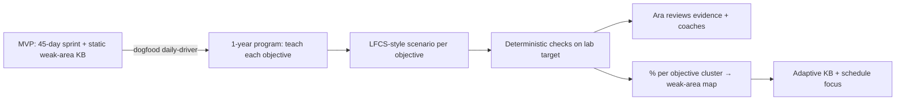
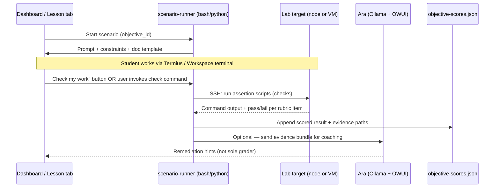
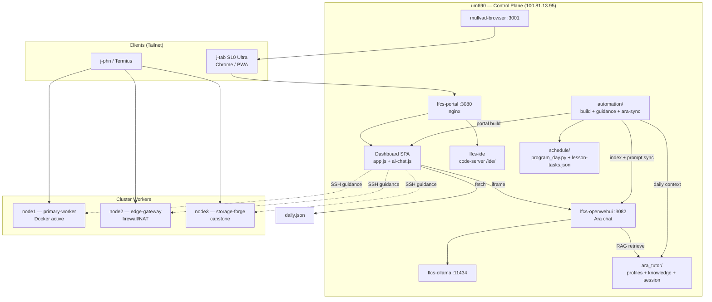
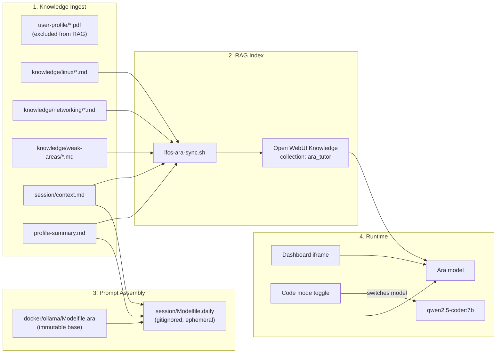
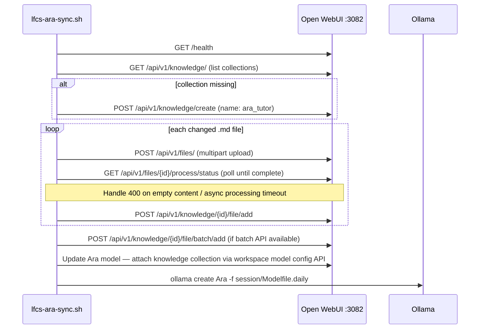

# AIOS Education IDE — System Design

| Field | Value |
|-------|-------|
| **Author** | Systems Architecture (Draft) |
| **Date** | June 15, 2026 |
| **Status** | Draft (rev 4 — post-review round 3) |
| **Implementation repo** | `aios-ed` → `github.com/DestroyTheKraken/aios-os` |
| **Design repo** | `/home/kraken/Projects/AIOS` (docs only) |
| **Exam target** | LFCS — Dec 2026 / Jan 2027 |

---

## Overview

**AIOS Education IDE** is a tailnet-hosted EdTech daily-driver for LFCS exam preparation. The learner opens a single dashboard (`http://100.81.13.95:3080/`) on a Samsung Tab S10 Ultra (or any tailnet client), sees today's 45-day program lesson, launches a browser IDE and lab browser, and studies with **Ara** — a local personalized tutor backed by Ollama and Open WebUI on um690.

The stack is already operational (Phase 2 complete): Docker Compose services in `docker/docker-compose.yml`, static dashboard in `portal/`, daily data pipeline in `automation/lfcs-portal-build.sh` + `lfcs-daily-guidance.sh`, and cluster inventory in `inventory/cluster.json`. Phase 3 (responsive dashboard + Ara sidebar) is active.

This design specifies the **full path to LFCS exam readiness** — architecture, infrastructure, automation, and the **Ara tutoring subsystem** optimized as the primary quality constraint. All runnable changes land in the LFCS repo; AIOS remains product/design documentation.

---

## Background & Motivation

### Current state (June 15, 2026 — Program Day 2)

| Layer | Status | Key paths |
|-------|--------|-----------|
| Control plane | Live on um690 | `docker/docker-compose.yml`, `automation/lfcs-backend-deploy.sh` |
| Dashboard | Home / Lesson / Workspace tabs | `portal/static/app.js`, `portal/www/data/daily.json` |
| Ara UI | Right sidebar iframe → Open WebUI :3082 | `portal/static/ai-chat.js` |
| Tutor models | `Ara` (llama3.2:3b), `qwen2.5-coder:7b` | `docker/ollama/Modelfile.ara`, `automation/lfcs-ollama-setup.sh` |
| Knowledge base | Scaffold only | `ara_tutor/user-profile/*.pdf`, **no** `knowledge/linux|networking/` or `session/` dirs |
| RAG | **Not indexed** | Manual steps in `automation/lfcs-ara-knowledge.sh` |
| Lesson context | In `daily.json` / guidance markdown | **Not injected into Ara** |
| Program day logic | **Divergent** | guidance loops post-day-45; portal caps at day 45 |
| PWA | Meta tags only | `portal/shell/index.html` — no manifest or service worker |
| Cluster | 4/4 nodes up | `inventory/cluster.json`, `guides/CLUSTER_MAP.md` |

### Pain points

1. **Ara is generic** — `Modelfile.ara` has a static SYSTEM block; Open WebUI has no Knowledge collection attached; learner profile PDFs are unreadable by the model without summarization.
2. **No lesson coupling** — Dashboard knows `program_day`, `project`, `phase`, `node` (from `schedule/daily-schedule.json`), but the Ara iframe loads bare Open WebUI with no session preamble.
3. **Weak-area gap** — Learner is weak on `grep`/`awk`/`sed`, docker-compose authoring, and `git` (per AIOS goals doc); Project 02 (text processing) is Day 5–6 but no targeted Ara reference content exists.
4. **Operational friction** — RAG setup is manual (Open WebUI Admin UI); portal rebuild and guidance are separate cron/manual steps; program-day calculation differs between scripts.
5. **Security debt** — `WEBUI_AUTH=false`; workspace password embedded in `daily.json` at build time (`lfcs-portal-build.sh` lines 146–154).

### Why now

Phase 4 (RAG + lesson context + PWA) is the critical unlock for Ara tutoring quality before the learner enters Projects 02–09 (text processing, networking, capstone). Without RAG and context injection by ~July 2026, Ara cannot fulfill its role as the sole tutor through the 45-day cycle and second mastery pass.

---

## Goals & Non-Goals

### Goals

| # | Goal | Success metric |
|---|------|----------------|
| G1 | **Ara tutoring quality** — personalized, context-aware, RAG-backed | ≥80% pass rate on canonical eval prompt suite (see Observability); learner thumbs-up ≥70% |
| G2 | Daily-driver UX on tablet | Dashboard TTI < 2s; PWA installable on j-tab |
| G3 | LFCS exam readiness by Dec 2026 / Jan 2027 | ≥70% objectives closed (`guides/OBJECTIVES_TRACKER.md`); mock exam pass |
| G4 | Reproducible tailnet stack | One-shot deploy via `lfcs-backend-deploy.sh`; git-tracked compose |
| G5 | Lesson-schedule integration | Ara aware of program day, project, phase, target node on every session |
| G6 | Weak-area remediation (MVP) | Static KB stubs for known gaps (grep/awk/sed, compose, git); Ara surfaces them on tagged schedule days |
| G7 | **Build-then-study workflow** | Ship AIOS MVP on um690 first; learner uses the finished stack to prep for LFCS exam (Dec 2026 target) |

### Weak-area evolution (MVP → adaptive)

**MVP (now → Jul 2026):** Three hand-authored files under `ara_tutor/knowledge/weak-areas/` plus explicit `weak_area` tags on schedule days (5, 6, 24, 26, 40, 41). This reflects the learner's *self-reported* gaps from early assessment — sufficient to develop and dogfood the platform.

**Target (post-MVP):** Weak areas become **data-driven**, measured against **all LFCS exam objectives** (`guides/OBJECTIVES_TRACKER.md` domains). See **LFCS-style scenario assessment** (below) — the one-year program teaches objectives iteratively; each objective ends in a practical scenario graded like the live exam.



### LFCS-style scenario assessment (1-year program)

**Program shape:** The learner's **45-day cycle** is a compressed sprint for Dec 2026 exam prep. The full **AIOS Linux sysadmin course** spans ~**one year**: each LFCS objective from `guides/OBJECTIVES_TRACKER.md` is taught progressively, then validated with a **performance scenario** — same modality as the live LFCS exam (SSH into a environment, complete tasks, state is verified).

**Not multiple-choice.** Scenarios present constraints ("configure X to persist across reboot", "restrict Y to tailnet only") and the student works in a real shell on a lab target.

#### Assessment flow



#### Three layers (checks first, AI second)

| Layer | Role | Trust |
|-------|------|-------|
| **1. Scenario runner** | Bash/Python CLI (`validation/scenario-runner.py` + per-scenario `checks.sh`) guides the student, records choices/commands in a session log | Authoritative workflow |
| **2. Deterministic assertions** | Remote checks on lab target — file exists, `systemctl is-active`, `ss` binding, config line present, reboot-survives (pattern from `validation/VALIDATION.md`, Project 09 forge) | **Authoritative grade** — mirrors LFCS human grader criteria |
| **3. Ara review** | Triggered by user prompt ("check my scenario") or dashboard **Check my work** button firing `lfcs-scenario-verify.sh` → passes evidence to Ara | **Coaching only** — explains failures, suggests next steps; does not override assertion results |

Assertions must pass without AI. Ara interprets failures for pedagogy (weak-area feedback, link to KB snippets).

#### Lab target options (phased)

| Phase | Environment | Pros | Cons |
|-------|-------------|------|------|
| **A — MVP study** | Existing cluster nodes (`node1`–`node3`) via Tailscale SSH | Already live; matches current 45-day projects | Shared state; needs reset scripts between scenarios |
| **B — Recommended next** | **LXD containers on node1** (15 GB RAM, Docker already active; um690 also has LXD per `CLUSTER_MAP.md`) | Ephemeral instance per scenario; snapshot restore; exam-isolated | Requires `lfcs-lab-provision.sh` + image pipeline |
| **C — Stretch** | Full libvirt VM per session | Maximum isolation | Heavy on single-node RAM; slower provision |

**Recommendation:** Start Phase A while building MVP (reuse Project 01–09 nodes). Move scored scenarios to **Phase B LXD** when the scenario runner ships — one container per attempt, destroy on pass or reset on fail.

#### Proposed repo layout (post-MVP)

```
LFCS/
├── scenarios/
│   ├── manifest.json              # objective_id → scenario paths, lab profile
│   ├── essential-commands/
│   │   └── ec-01-links/
│   │       ├── prompt.md          # student-facing scenario (LFCS-style brief)
│   │       ├── rubric.json        # weighted checks, pass threshold %
│   │       ├── checks.sh          # SSH assertions run ON lab target
│   │       └── reset.sh           # restore lab baseline
│   └── networking/
│       └── net-03-firewall-nat/
│           └── ...
├── validation/
│   ├── scenario-runner.py         # orchestrate: prompt → log → check → score
│   └── test_scenario_runner.py
├── ara_tutor/user-profile/
│   └── objective-scores.json      # % per domain + per objective_id, history[]
└── automation/
    └── lfcs-scenario-verify.sh    # dashboard button / Ara trigger entrypoint
```

#### Scoring model

- Each scenario defines `rubric.json`: weighted assertion groups mapped to `OBJECTIVES_TRACKER.md` rows.
- **Objective score** = passed_weight / total_weight × 100.
- **Domain score** = rolling average of objectives in that LFCS domain (Essential Commands 20%, Operations 25%, etc.).
- Scores below threshold (e.g. 70%) auto-flag `weak_area` entries and feed Ara + `ara_tutor/knowledge/weak-areas/` regeneration (replacing static stubs).

#### Dashboard integration (future PRs, not MVP)

- Lesson tab: scenario brief + **Start lab** (opens target SSH hint or provisions LXD)
- **Check my work** button → `POST /api/scenario-verify` or local `lfcs-scenario-verify.sh` via guidance cron hook
- Results card: assertion breakdown + link to Ara with evidence pre-loaded
- `daily.json` enrichment: `objectives_progress`, `last_scenario_scores`

#### Relation to current 45-day schedule

| Timeline | Program | Assessment |
|----------|---------|------------|
| Jun–Jul 2026 | Build MVP (PR 1–19) | Manual validation (`VALIDATION.md` pattern) |
| Aug–Nov 2026 | 45-day sprint + exam drills | Projects 00–09 = proto-scenarios; informal pass/fail |
| Post-MVP / Year 1 | Full objective coverage | Formal scenario runner + scored weak areas |
| Dec 2026 | LFCS exam | Learner uses dogfooded stack; scenario scores guide remediation |

### Non-Goals

- External cloud AI (Grok/Claude/Gemini) in dashboard
- Custom native IDE (code-server is sufficient)
- Corporate/music verticals
- Public internet exposure of any service
- GPU migration or models > 7B on um690 CPU (latency budget ~5–8s)
- Kubernetes migration (microk8s on um690 is out of LFCS scope)
- Replacing Obsidian/Syncthing for long-form notes
- **Full 1-year scenario curriculum** — MVP ships 45-day sprint; year-long objective-by-objective scenarios deferred (see LFCS-style scenario assessment)
- **LXD lab provisioner** — deferred to Phase B of scenario assessment; MVP uses existing cluster nodes

---

## Proposed Design

### High-level architecture



### Deploy layout (um690)

Production compose does **not** run from the git checkout directly. Operators must understand both paths:

| Path | Role |
|------|------|
| `/home/kraken/Projects/aios-ed` (`LFCS_ROOT`) | Git repo — portal source, `ara_tutor/`, automation scripts, bind-mount source |
| `/opt/lfcs/secure-browser-forge` (`DEPLOY_DIR`) | Live compose working dir — `docker-compose.yml` copy, `.env`, systemd unit target |
| `${DEPLOY_DIR}/.env` | Runtime secrets: `FORGE_BIND_IP`, `FORGE_WEB_PASSWORD`, `OPENWEBUI_API_KEY`, `LFCS_ROOT` |
| `openwebui-data`, `ollama-data` | Named Docker volumes (not under `LFCS_ROOT`) |

**Bind mounts from `LFCS_ROOT`** (per `docker-compose.yml`):
- `${LFCS_ROOT}/portal/www` → portal static HTML
- `${LFCS_ROOT}/portal/static` → dashboard assets
- `${LFCS_ROOT}/ara_tutor` → Open WebUI knowledge mount (read-only)

**Path resolution in automation scripts:**

Both `lfcs-backend-deploy.sh` and `lfcs-ara-sync.sh` set defaults at script top:

```bash
SCRIPT_DIR="$(cd "$(dirname "${BASH_SOURCE[0]}")" && pwd)"
LFCS_ROOT="$(cd "${SCRIPT_DIR}/.." && pwd)"
DEPLOY_DIR="${DEPLOY_DIR:-/opt/lfcs/secure-browser-forge}"
ENV_FILE="${DEPLOY_DIR}/.env"
# Source env if present (API key, bind IP, etc.)
[[ -f "${ENV_FILE}" ]] && set -a && source "${ENV_FILE}" && set +a
```

Manual runs from `LFCS_ROOT` work without exporting `DEPLOY_DIR` — the default matches `lfcs-backend-deploy.sh` line 21.

**Operator workflow after `git pull`:**

```bash
cd /home/kraken/Projects/aios-ed
./automation/lfcs-portal-build.sh          # rebuild daily.json + context.md
sudo ./automation/lfcs-backend-deploy.sh   # only if compose/.env changed
./automation/lfcs-ara-sync.sh              # RAG + Modelfile.daily regen
```

Portal-only changes do **not** require compose restart — nginx serves rebuilt `portal/www/` immediately. Compose changes require `docker compose -f ${DEPLOY_DIR}/docker-compose.yml up -d` (handled by deploy script).

### Shared schedule logic (`schedule/program_day.py`)

**Bug today:** `lfcs-daily-guidance.sh` (lines 37–41) **loops** program days after day 45; `lfcs-portal-build.sh` (line 50) **caps** at day 45. After Cycle 1 ends (~Jul 28, 2026), guidance advances to Cycle 2 but dashboard and Ara `context.md` remain stuck on day 45.

**Fix:** Extract shared module used by both scripts (and `lfcs-ara-sync.sh`):

```python
# schedule/program_day.py
def compute_program_day(schedule: dict, today: date) -> tuple[int, dict, int]:
    """
    Single source of truth for program day resolution.
    Policy: cap at max_day until learner sets a new start_date (OQ4).
    Cycle 2+ begins only when start_date is manually advanced in daily-schedule.json.

    Returns: (day_num, entry, cycle_num)
    cycle_num: increment when schedule metadata cycle_start_date changes (PR 6).
    """
    start = date.fromisoformat(schedule["start_date"])
    max_day = max(d["day"] for d in schedule["days"])
    raw = (today - start).days + 1
    cycle_num = schedule.get("cycle", 1)
    if raw < 1:
        day_num = 1
    elif raw > max_day:
        day_num = max_day  # hold on final day until start_date reset
    else:
        day_num = raw
    entry = next(d for d in schedule["days"] if d["day"] == day_num)
    return day_num, entry, cycle_num
```

**`program_cycle` examples:**

| Calendar offset (`raw`) | `day_num` | `cycle_num` |
|-------------------------|-----------|-------------|
| 1 | 1 | 1 |
| 45 | 45 | 1 |
| 46 (no start_date change) | 45 | 1 |
| 1 (after new start_date) | 1 | 2 |

Both `lfcs-portal-build.sh` and `lfcs-daily-guidance.sh` import this module. Add unit test `validation/test_program_day.py` with cases: day 1 → cycle 1; day 45 → cycle 1; day 46 without schedule edit → day 45 capped; new `start_date` → day 1, cycle 2.

### Shared task source (`schedule/lesson-tasks.json`)

Tasks currently live only in an inline dict inside `lfcs-daily-guidance.sh` (lines 85–98). Migrate **all 12 keys** plus fallback behavior into JSON + Python helper.

**Full `schedule/lesson-tasks.json`** (authoritative migration from `lfcs-daily-guidance.sh:85-98`):

```json
{
  "_templates": {
    "mix": [
      "Set timer for {duration} minutes",
      "No internet — man pages only",
      "Document every command in study journal"
    ],
    "fallback": [
      "Open Study_Projects/{project}.md",
      "Complete phase {phase}",
      "Log results in study journal"
    ]
  },
  "00": ["Run: man -k partition", "Run: man 5 fstab", "Find bash loop example in man bash"],
  "01": ["ssh kraken@node1", "mkdir -p /projects/archive/2026/", "Create symlink + hard link, verify"],
  "02": ["grep 'Failed password' /var/log/auth.log", "awk to extract IPs → /tmp/threat_actors.txt", "tar -czvf /backup/incident.tar.gz"],
  "03": ["groupadd dev_dept; useradd team members", "chmod 2770 /shared/dev", "setfacl + sudoers.d"],
  "04": ["Write /etc/systemd/system/myapp.service", "systemctl enable --now myapp", "Add limits.conf + sysctl.d"],
  "05": ["parted GPT on secondary disk", "mkfs.xfs + blkid UUID", "fstab entry + mount -a + reboot test"],
  "06": ["nmcli static IP", "/etc/hosts entries", "sshd_config.d hardening + NFS mount"],
  "07": ["firewalld default deny", "sysctl ip_forward persist", "MASQUERADE + port forward"],
  "08": ["Write /usr/local/bin/sysmaintenance.sh", "set -euo pipefail", "crontab 0 0 * * *"],
  "09": ["sudo ./automation/secure-browser-forge.sh", "Option 1 deploy on node3", "Reboot + option 4 validate"],
  "—": ["Review notifications/study-journal.log", "Re-run weakest project verification", "Update VALIDATION.md evidence"]
}
```

Note: `mix` is **not** a static array — it uses `_templates.mix` with `{duration}` substituted from the schedule entry's `duration_min`.

**`get_tasks(project, phase, duration_min)` specification** (in `schedule/program_day.py`):

```python
def get_tasks(project: str, phase: str, duration_min: int, tasks_db: dict) -> list[str]:
    if project == "mix":
        return [t.format(duration=duration_min) for t in tasks_db["_templates"]["mix"]]
    if project in tasks_db and not project.startswith("_"):
        return list(tasks_db[project])
    # fallback for unknown project keys (e.g. future schedule edits)
    return [t.format(project=project, phase=phase) for t in tasks_db["_templates"]["fallback"]]
```

**Unit tests** (`validation/test_lesson_tasks.py`):
- `get_tasks("00", "1-2", 45)` → 3 static strings
- `get_tasks("mix", "drill", 45)` → first item contains `"45 minutes"`
- `get_tasks("99", "1", 60)` → fallback with `project=99`, `phase=1`

`lfcs-daily-guidance.sh`, `lfcs-portal-build.sh` (for `context.md`), and `session_preamble` all call `get_tasks()` — no duplicated task logic.

### Ara tutoring subsystem (primary constraint)

Ara quality is delivered through four cooperating layers:



#### Layer 1 — Knowledge corpus (`ara_tutor/`)

Expand the existing mount (`docker-compose.yml` line 112):

```
ara_tutor/
├── user-profile/
│   ├── *.pdf                          # source only — NOT indexed after PR 5
│   └── profile-summary.md             # generated; indexed
├── knowledge/
│   ├── linux/                         # 4 core docs
│   ├── networking/                    # 3 core docs
│   └── weak-areas/
│       ├── grep-awk-sed.md
│       ├── docker-compose.md
│       └── git-lfcs.md
├── session/
│   ├── context.md                     # regenerated each portal build
│   └── Modelfile.daily                # gitignored; generated by ara-sync
└── meta/
    └── indexing-manifest.json
```

**Manifest inclusion rules** (prevents PDF pollution — see Issue 9):

| Include | Exclude |
|---------|---------|
| `user-profile/profile-summary.md` | `user-profile/*.pdf` (after summary exists) |
| `knowledge/**/*.md` | `session/Modelfile.daily` |
| `session/context.md` | `meta/*` |

If `profile-summary.md` is missing, sync **fails fast** with message to run `lfcs-profile-summarize.sh` — never upload raw PDFs.

#### Layer 2 — RAG indexing automation

Replace manual steps in `lfcs-ara-knowledge.sh` with `automation/lfcs-ara-sync.sh`:

**Prerequisites (fail fast if missing):**
- `ara_tutor/session/context.md` exists (generated by prior `lfcs-portal-build.sh` run)
- `ara_tutor/user-profile/profile-summary.md` exists
- `${DEPLOY_DIR}/.env` readable if auth probe requires it (see Auth below — key is **not** unconditionally required)

**Sync steps (does NOT re-run portal-build):**

0. Resolve paths: `DEPLOY_DIR="${DEPLOY_DIR:-/opt/lfcs/secure-browser-forge}"`; source `${DEPLOY_DIR}/.env` if present.
0b. **Auth probe (S0):** test unauthenticated API access once; record `auth_mode=none|bearer` in log. If 401 without key → fail fast with bootstrap instructions; if 2xx without key → proceed without Bearer header.
1. Run `automation/lfcs-profile-summarize.sh` if PDFs newer than `profile-summary.md`.
2. **Read** `ara_tutor/session/context.md` — exit 1 with clear message if absent. Parse `program_day`, `program_cycle`, `project`.
3. Compute content hash manifest in `ara_tutor/meta/indexing-manifest.json` (per inclusion rules above).
4. **RAG idempotency:** If manifest `content_hash` unchanged → **skip steps 5–6 only** (no re-upload). Steps 6a–6b (model attach/FC) run if hash changed OR `last-sync-state.json` shows `model_config_ok: false`.
5. Open WebUI RAG upload flow (steps 3–5 in API table) — **only when step 4 allows**.
6a. Attach collection to `Ara` model workspace config (when needed).
6b. Verify/disable native FC on `Ara` (when needed).
7. **Modelfile idempotency (separate scope):** Compare `program_day` + `program_cycle` from `context.md` against `ara_tutor/meta/last-sync-state.json`. Regenerate `session/Modelfile.daily` + `ollama create` when day/cycle changed **or** `content_hash` changed — **even if step 4 skipped RAG re-upload**.
8. Run split eval harness: RAG suite via Open WebUI (gates sync); overlay suite via `ollama run` with **dynamic** expectations (warn-only).
9. Update `last-sync-state.json`; log timing + `rag_pass` to `notifications/ara-sync.log`; log full suite detail to `notifications/ara-eval.log`.

**Open WebUI RAG API flow** (verified against [Open WebUI API reference](https://docs.openwebui.com/reference/api-endpoints/)):



**Spike gate (PR 7):** Before merging automation, run manual API sequence against live `ghcr.io/open-webui/open-webui:main` on um690. Document exact request/response shapes in `guides/ARA_SYNC_API.md`. Admin UI fallback is **not** acceptable for cron.

**`guides/ARA_SYNC_API.md` spike checklist** (PR 7 merge blocker):

| Spike step | What to verify | Blocks |
|------------|----------------|--------|
| **S0 — Auth** | Unauthenticated `GET /api/v1/knowledge/` and `POST /api/v1/files/` on tailnet bind with `WEBUI_AUTH=false`; if 401, document key-creation procedure | Issues 1–2 |
| **S1 — File upload** | Steps 3–5: upload → poll → add-to-collection | Issue 1 |
| **S2 — Model attach** | Endpoint + payload to attach `ara_tutor` collection to workspace model `Ara` | Issue 1 |
| **S3 — Native FC disable** | API field or Admin export showing how to set `function_calling = none` / disable native FC on `Ara` | Issue 1, KD11 |
| **S4 — Chat with RAG** | `POST /api/chat/completions` returns content citing indexed chunks | Issue 3 |

Step 6 API table rows are populated **only after S2–S3 confirm** — no placeholder endpoints in merged automation.

**Alternative path:** If file-upload API proves fragile, evaluate Open WebUI **directory sync** for the mounted `/app/backend/data/ara_tutor` tree (read-only volume) — may require writeable copy or sync into OWUI data dir. Spike compares reliability vs. upload API.

**Native function calling guard (Issue 7):** Open WebUI docs state that when native/agentic function calling is enabled on a model, attached knowledge is **not automatically injected** — the model must explicitly call knowledge tools. PR 12 must verify and enforce:

- `Ara` model config: **disable** native function calling (use default RAG injection mode).
- System prompt includes: "Use attached knowledge base `ara_tutor` for reference lookups."
- Acceptance test: prompt "What is today's project?" must return day/project from RAG or Modelfile overlay.

**Idempotency (two scopes):**

| Scope | Skip condition | Still runs when skipped |
|-------|--------------|-------------------------|
| **RAG re-upload** (steps 5–6) | `content_hash` unchanged | Steps 7–9 always evaluated |
| **Modelfile regen** (step 7) | `program_day` + `program_cycle` unchanged **and** hash unchanged | — |

Typical weekday: hash stable, day advances → skip RAG upload (~30–60s saved), **still regen Modelfile.daily**.

**`ara_tutor/meta/last-sync-state.json`** (written at step 9):

```json
{
  "program_day": 2,
  "program_cycle": 1,
  "content_hash": "sha256:abc123...",
  "model_config_ok": true,
  "auth_mode": "none",
  "synced_at": "2026-06-15T07:05:12-05:00"
}
```

#### Layer 2b — API authentication (`WEBUI_AUTH=false`)

`docker-compose.yml` line 97 sets `WEBUI_AUTH=false`. Auth behavior is **equally blocking** as file-upload — spike **S0 runs first** (before any upload test).

**Spike S0 procedure:**

```bash
# 1. Test unauthenticated access (record status codes)
curl -s -o /dev/null -w "%{http_code}" http://${TS_IP}:3082/api/v1/knowledge/
curl -s -o /dev/null -w "%{http_code}" -X POST http://${TS_IP}:3082/api/v1/files/

# 2. If 401: test with Bearer token
curl -H "Authorization: Bearer ${OPENWEBUI_API_KEY}" ...
```

| S0 outcome | Bootstrap path for `lfcs-backend-deploy.sh` |
|------------|---------------------------------------------|
| Unauthenticated calls succeed (200/2xx) | Sync may omit Bearer header; still recommend key for Phase 5 readiness |
| 401 without key | **Path A:** Temporarily set `WEBUI_AUTH=true`, create API key in Admin → Settings → Account, store in `${DEPLOY_DIR}/.env`, revert `WEBUI_AUTH=false` if desired for UI |
| 401 without key | **Path B:** If OWUI allows key generation under `WEBUI_AUTH=false` via Admin UI — document exact clicks; automate in deploy script |
| Key required (401 without key) | `OPENWEBUI_API_KEY` in `${DEPLOY_DIR}/.env` (mode 600, root-owned); **not** in compose `environment` block |

**Prerequisite rule (aligned with S0):** `OPENWEBUI_API_KEY` is required **only if** step 0b auth probe returns 401 without Bearer token. If S0 recorded unauthenticated 2xx, sync proceeds without key; `auth_mode: "none"` logged in `last-sync-state.json`. Script startup branches on probe result — no unconditional fail-fast on missing key.

`lfcs-ara-sync.sh` sources `${DEPLOY_DIR}/.env` on the **host** when present. API calls include `Authorization: Bearer ${OPENWEBUI_API_KEY}` **only when** `auth_mode=bearer`.

**Key location:** `${DEPLOY_DIR}/.env` only — **not** passed to `lfcs-openwebui` container env (Open WebUI does not consume this variable for inbound auth).

Phase 5 (PR 16): Enable `WEBUI_AUTH=true` for UI; retain API key for automation. Key rotation: update `.env` + re-run deploy.

#### Layer 3 — Dynamic prompt assembly (ephemeral overlay)

**Static base (immutable, git-tracked):** `docker/ollama/Modelfile.ara`

**Generated overlay (gitignored):** `ara_tutor/session/Modelfile.daily` — concatenation of base + `TODAY'S SESSION` block from `context.md` + profile excerpt.

```dockerfile
# ara_tutor/session/Modelfile.daily (generated — NOT committed)
FROM llama3.2:3b
PARAMETER num_ctx 4096          # raised from 2048 — see capacity notes
PARAMETER num_predict 384
PARAMETER temperature 0.5
SYSTEM """
...full static system from Modelfile.ara...

TODAY'S SESSION (auto-generated 2026-06-15)
- Program day: 2 of 45 (cycle 1)
- Project: 00 — Documentation Matrix
- Phase: 3-4
- Target node: um690 (100.81.13.95)
- LFCS domains: Essential Commands
- Study guide: /study/00.md
- Today's tasks: [from lesson-tasks.json]
- Weak-area focus: none (grep-awk-sed starts Day 5)
- Learner style: [from profile-summary.md]
"""
```

**Regeneration policy:**
- Run `ollama create Ara -f ara_tutor/session/Modelfile.daily` when `program_day` or `program_cycle` changes OR manifest `content_hash` changes — **independent of RAG re-upload skip** (see Layer 2 step 7).
- Compare against `ara_tutor/meta/last-sync-state.json` before regen.
- Expected duration on um690 CPU: ~15–30s (acceptable once per day at 07:00 cron).
- `docker/ollama/Modelfile.ara` is **never mutated** by automation.

**Context window:** Base `num_ctx 2048` may truncate with RAG top-k=5 + overlay + profile. PR 8 acceptance tests load realistic prompt; default to `num_ctx 4096` if p95 latency remains <8s.

#### Layer 4 — Dashboard ↔ Ara context bridge

**Phase 4a (Jul 15 acceptance path):** RAG + daily Modelfile overlay only. Iframe URL remains bare `http://{tailscale_ip}:3082/` per `ai-chat.js:27-28`. No query-param changes until OQ1 spike passes.

**Phase 4b (gated on OQ1 spike):** Separate PR 10b — iframe URL params only after verifying Open WebUI `main` supports `models` / `prompt` query params on um690.

**Coder model routing (Issue 12):** Add dashboard affordance in `ai-chat.js`:

```javascript
// Code mode toggle in Ara toolbar
const codeModeUrl = `${base}?models=${encodeURIComponent(data.ara.coder_model)}`;
const tutorModeUrl = `${base}?models=${encodeURIComponent(data.ara.model)}`;
```

Plus system-prompt convention in `Modelfile.ara`: "If the learner prefixes a message with `#code`, recommend switching to code mode for compose/git/script questions."

Persist toggle in `localStorage` key `lfcs-ara-code-mode`. Included in PR 10c (parallel with 10b).

**Phase 4c (future):** nginx `/ai/` reverse-proxy with shared auth — see PR 16 auth spike.

### Dashboard application architecture

Existing SPA pattern in `portal/static/app.js` (IIFE, no bundler) is retained.

| Tab | Component | Data source |
|-----|-----------|-------------|
| Home | Welcome (guidance markdown), overview, resources | `daily.json` → `guidance`, `schedule`, `resources` |
| Lesson | 45-day nav, phase steps | `daily.json` → `days[]`, `guidance` |
| Workspace | code-server iframe | `urls.ide` → `/ide/` proxied in `nginx.conf:54-65` |

**Build pipeline:**

```
install-daily-cron.sh
  └── ONE cron entry: lfcs-daily-guidance.sh (07:00)
        → schedule/program_day.py + lesson-tasks.json
        → notifications/daily/YYYY-MM-DD.md
        → lfcs-portal-build.sh
            → portal/www/data/daily.json
            → ara_tutor/session/context.md
        → lfcs-ara-sync.sh   ← invoked ONLY here, at tail of guidance script
            → RAG re-index + Modelfile.daily regen + eval harness
```

**Cron rule:** `lfcs-ara-sync.sh` is **not** a separate cron line. `install-daily-cron.sh` schedules only `lfcs-daily-guidance.sh`. Manual runs: `./automation/lfcs-ara-sync.sh` after `./automation/lfcs-portal-build.sh` (context.md prerequisite). A standalone ara-sync cron would race portal-build and hit the context.md fail-fast.

### Cluster & lab infrastructure

No structural change to the 4-node topology documented in `inventory/cluster.json` and `guides/CLUSTER_MAP.md`.

| Node | Tailscale IP | LFCS role | Primary projects |
|------|-------------|-----------|------------------|
| um690 | 100.81.13.95 | control-plane | 00, 02, 08, scheduling, **all AI services** |
| node1 | 100.75.124.36 | primary-worker | 01, 04, 06, 09-prep |
| node2 | 100.104.54.20 | edge-gateway | 06, 07 |
| node3 | 100.82.177.52 | storage-forge | 03, 05, 09 |

**Design rule:** Ollama + Open WebUI stay on um690 only (`OLLAMA_MAX_LOADED_MODELS=1`, 10GB mem_limit).

**Phase 1 hardening** (parallel track):
- `lfcs-cluster-scan.sh` freshness <24h — **already implemented** in `lfcs-daily-guidance.sh` lines 21–23; Sunday 06:30 cron in `install-daily-cron.sh`
- ufw tailnet-only rules from `lfcs-backend-deploy.sh`
- **Chrony NTP** on all cluster nodes — PR 19 (see PR Plan)

### PWA shell (Phase 4)

Add to `portal/static/`:

| File | Purpose |
|------|---------|
| `manifest.webmanifest` | Installable app metadata, `start_url: /`, theme from Kanagawa palette |
| `sw.js` | Cache-first for `/static/*`; network-first for `/data/daily.json` |
| Icons | `icons/icon-192.png`, `icons/icon-512.png` |

**Offline behavior:** Shell + CSS load offline; dashboard shows stale `daily.json` with "offline" banner. Ara and IDE require tailnet.

### Automation inventory (target state)

| Script | Role | Trigger |
|--------|------|---------|
| `lfcs-backend-deploy.sh` | One-shot stack provision + API key bootstrap | Manual / reinstall |
| `schedule/program_day.py` | Shared day resolution | imported by build/guidance/sync |
| `lfcs-portal-build.sh` | `daily.json` + `context.md` | guidance, manual |
| `lfcs-daily-guidance.sh` | Daily notice + portal refresh | cron 07:00 |
| `lfcs-ara-sync.sh` | RAG index + Modelfile.daily + eval | **tail of `lfcs-daily-guidance.sh` only** (not separate cron) |
| `lfcs-profile-summarize.sh` | PDF → `profile-summary.md` | weekly or on PDF change |
| `lfcs-ollama-setup.sh` | Model pull + Ara create from base Modelfile | deploy |
| `lfcs-ara-knowledge.sh` | **Deprecated** → migrate notice | — |
| `lfcs-cluster-scan.sh` | Inventory refresh | guidance if stale >24h |
| `install-daily-cron.sh` | Schedules **single** daily guidance entry (which chains ara-sync) | deploy |

### Timeline to LFCS exam readiness

| Milestone | Target date | Exit criteria | PRs |
|-----------|-------------|---------------|-----|
| Weak-area KB ready | Jun 18, 2026 | `grep-awk-sed.md` indexed | PR 1–3 |
| RAG live | Jul 1, 2026 | RAG eval suite ≥80% via Open WebUI (not ollama-only) | PR 7, 12 |
| Context injection | Jul 15, 2026 | Day N prompts correct (Phase 4a) | PR 6, 8, 9 |
| Credential fix | Jul 1, 2026 | No password in `daily.json` | PR 6b |
| PWA on tablet | Jul 15, 2026 | j-tab install works | PR 11 |
| Cycle 1 complete | ~Jul 28, 2026 | Day 45 logged; day 46 loops correctly | PR 6 |
| Weak areas closed | Oct 2026 | Timed drill pass | PR 2–3 |
| Mock exam pass | Nov 2026 | 2-hour mock ≥80% | — |
| LFCS exam | Dec 2026 / Jan 2027 | Certification attempt | — |

### Performance & capacity estimates

| Resource | Current | Target | Notes |
|----------|---------|--------|-------|
| Ara latency (first token) | ~3–5s | <8s p95 | llama3.2:3b; log via ara-sync smoke test |
| RAG retrieval | N/A | <500ms | MiniLM embeddings; log in ara-sync.log |
| `ara_tutor` corpus size | ~1.9MB PDFs only | ~3–5MB text | Markdown only in index |
| `daily.json` size | **21,480 bytes (~21KB)** | <30KB | `wc -c portal/www/data/daily.json` verified 2026-06-15 |
| Dashboard TTI (tablet) | ~1.5s | <2s | Static assets cached by SW |
| Modelfile regen | N/A | <30s | Once per day at cron |
| Ollama `num_ctx` | 2048 | 4096 (if latency OK) | Test under RAG top-k=5 + overlay |
| Concurrent users | 1 | 1 | Single-learner design |

---

## API / Interface Changes

### `portal/www/data/daily.json` — extended `ara` block

```json
"ara": {
  "name": "Ara",
  "model": "Ara",
  "coder_model": "qwen2.5-coder:7b",
  "knowledge_base": "ara_tutor",
  "host": "um690",
  "rag_synced_at": "2026-06-15T07:05:00-05:00",
  "rag_status": "ok",
  "session_preamble": "Day 2/45 · Project 00 phase 3-4 on um690 · Essential Commands",
  "weak_areas_active": [],
  "profile_loaded": true,
  "default_model": "Ara"
}
```

`rag_status` / `rag_synced_at` populated from `notifications/ara-sync.log` tail (not before PR 9).

### `monitoring.ara` block (extended)

```json
"monitoring": {
  "ara": {
    "status": "ok",
    "last_sync": "2026-06-15T07:05:00-05:00",
    "model_loaded": "Ara",
    "last_rag_ms": 320,
    "last_inference_ms": 4800,
    "last_rag_eval_pass_rate": 0.85
  }
}
```

`last_rag_eval_pass_rate` reflects **RAG suite only** (Jul 1 milestone gate per KD16). Overlay pass rate is in `ara-eval.log` only, not surfaced in `daily.json`.
```

### New file: `ara_tutor/session/context.md`

Generated by `lfcs-portal-build.sh` using `schedule/program_day.py` + `schedule/lesson-tasks.json`:

```markdown
# Ara Session Context
generated_at: 2026-06-15T02:00:01-05:00
program_day: 2
program_cycle: 1
project: "00"
phase: "3-4"
node: um690
node_ip: 100.81.13.95
title: "Documentation Matrix — /usr/share/doc & apt"
domains: ["Essential Commands"]
study_guide: /study/00.md
tasks:
  - "Run: man -k partition"
  - "Run: man 5 fstab"
  - "Find bash loop example in man bash"
weak_area_focus: null
```

### New file: `schedule/lesson-tasks.json`

Canonical task list — migrated from `lfcs-daily-guidance.sh` inline dict. See Shared task source section.

### New file: `ara_tutor/meta/indexing-manifest.json`

```json
{
  "version": 1,
  "generated_at": "2026-06-15T07:05:00-05:00",
  "content_hash": "sha256:abc123...",
  "included_patterns": ["user-profile/profile-summary.md", "knowledge/**/*.md", "session/context.md"],
  "excluded_patterns": ["user-profile/*.pdf", "session/Modelfile.daily", "meta/*"],
  "files": [
    {"path": "user-profile/profile-summary.md", "sha256": "..."},
    {"path": "knowledge/linux/essential-commands.md", "sha256": "..."}
  ]
}
```

### Open WebUI API (used by `lfcs-ara-sync.sh`)

| Step | Endpoint | Method | Purpose | Spike |
|------|----------|--------|---------|-------|
| 0a | `/health` | GET | Pre-flight | — |
| 0b | `/api/v1/knowledge/` | GET/POST | Auth probe (S0) | **S0 first** |
| 1 | `/api/v1/knowledge/` | GET | List collections; find `ara_tutor` id | S1 |
| 2 | `/api/v1/knowledge/create` | POST | Create collection if missing | S1 |
| 3 | `/api/v1/files/` | POST | Upload each changed markdown file (multipart) | S1 |
| 4 | `/api/v1/files/{id}/process/status` | GET | Poll until processing complete | S1 |
| 5 | `/api/v1/knowledge/{id}/file/add` | POST | Add processed file to collection | S1 |
| 6a | *TBD — spike S2* | POST/PATCH | Attach `ara_tutor` collection to workspace model `Ara` | **S2** |
| 6b | *TBD — spike S3* | POST/PATCH | Disable native function calling on `Ara` model | **S3** |
| 7 | `/api/chat/completions` | POST | RAG eval prompts (model: `Ara`, collection attached) | **S4** |

Steps 6a–6b endpoints are **TBD placeholders** until spike confirms paths. Expected shapes to capture in `guides/ARA_SYNC_API.md`:

```bash
# S2 — attach knowledge (example shape — confirm on um690)
curl -X POST "http://${TS_IP}:3082/api/v1/models/model" \
  -H "Authorization: Bearer ${OPENWEBUI_API_KEY}" \
  -H "Content-Type: application/json" \
  -d '{"id":"Ara","meta":{"knowledge":["<ara_tutor_collection_id>"]}}'

# S3 — disable native FC (example shape — confirm field name)
curl -X POST "http://${TS_IP}:3082/api/v1/models/model/update" \
  -H "Authorization: Bearer ${OPENWEBUI_API_KEY}" \
  -d '{"id":"Ara","meta":{"function_calling":"none"}}'
```

Exact URLs and payload fields **must match spike results** — example curls above are hypotheses only.

Auth: `Authorization: Bearer ${OPENWEBUI_API_KEY}` from `${DEPLOY_DIR}/.env` when S0 requires it.

**Error handling:** Retry 3x on 5xx; fail on 400 (empty content) with file path in log; timeout 120s per file processing poll.

### `portal/static/ai-chat.js`

- **PR 10a:** `rag_status` badge in `.ai-toolbar-note` (depends PR 9).
- **PR 10b:** iframe query params — gated on OQ1 spike (not Jul 15 path).
- **PR 10c:** Code mode toggle + `localStorage` persistence.

### `docker-compose.yml` — proposed env additions (PR 12 — before first sync)

```yaml
lfcs-openwebui:
  environment:
    - RAG_EMBEDDING_MODEL=sentence-transformers/all-MiniLM-L6-v2
    - ENABLE_RAG_WEB_SEARCH=false
    - RAG_TOP_K=5
    # OPENWEBUI_API_KEY is NOT set here — consumed by host-side lfcs-ara-sync.sh
    # from ${DEPLOY_DIR}/.env only (see Layer 2b)
```

`docker/.env.example` documents `OPENWEBUI_API_KEY=` for `${DEPLOY_DIR}/.env`, not compose service env.

---

## Data Model Changes

| Artifact | Change | Migration |
|----------|--------|-----------|
| `schedule/program_day.py` | **New** shared module | Both scripts import; add tests |
| `schedule/lesson-tasks.json` | **New** canonical tasks (12 keys + `_templates`) | Migrate `lfcs-daily-guidance.sh:85-98` |
| `validation/test_lesson_tasks.py` | **New** unit tests for `get_tasks()` | PR 6 |
| `schedule/daily-schedule.json` | Add `weak_area` field per day | Backward compatible — see mapping table |
| `ara_tutor/knowledge/linux/` | Populate 4 markdown files | PR 4 |
| `ara_tutor/knowledge/weak-areas/` | 3 files | PR 2, PR 3 |
| `ara_tutor/session/Modelfile.daily` | Generated, **gitignored** | Add to `.gitignore` |
| `ara_tutor/session/context.md` | Generated each portal build | PR 6 |
| `notifications/ara-sync.log` | Append-only timing + status | PR 7 |
| `notifications/ara-eval.log` | Eval harness results (rag + overlay detail) | PR 7 |
| `ara_tutor/meta/last-sync-state.json` | Day/cycle/hash for split idempotency | PR 7 |
| `guides/ARA_SYNC_API.md` | Spike documentation | PR 7 |
| `validation/test_ara_eval.py` | Dynamic overlay expectation tests | PR 7 |

### `weak_area` field — explicit day mapping (PR 6)

Resolved OQ6: use explicit `weak_area` in `daily-schedule.json`. **No inheritance from project** — only explicitly tagged days set a value; all others are `null`.

**Rule:** `weak_area` is set only on days listed below. Cycle 2 remix days 36–39 are `null` unless re-tagged in a future schedule edit.

| Day | Project | `weak_area` | Notes |
|-----|---------|-------------|-------|
| 1–4 | 00/01 | `null` | — |
| **5** | 02 | `grep-awk-sed` | Log analysis |
| **6** | 02 | `grep-awk-sed` | tar pipeline |
| 7–23 | various | `null` | Includes day 20 (shell scripting), day 22 (cron) |
| **24** | 09 | `docker-compose` | Capstone compose deploy |
| 25 | 09 | `null` | firewalld — not compose |
| **26** | 09 | `docker-compose` | Capstone validation |
| 27–39 | various | `null` | Includes remix days 36–39 (00, 03, 05, 07) |
| **40** | 08 | `git-lfcs` | Script from scratch |
| **41** | 09 | `docker-compose` | Timed capstone |
| 42–45 | review/graduate | `null` | — |

PR 6 adds `weak_area` field to each `days[]` entry in `daily-schedule.json` (nullable). `lfcs-portal-build.sh` sets `ara.weak_areas_active: [entry.weak_area]` when non-null, else `[]`.

---

## Alternatives Considered

### Alt 1: Replace Open WebUI with custom FastAPI chat proxy
**Decision:** Reject for Phase 4. Spike API automation first.

### Alt 2: External vector DB (Chroma/Qdrant)
**Decision:** Reject. Corpus <5MB.

### Alt 3: Larger model (qwen2.5:14b or qwen3) for Ara
**Decision:** Reject. Keep `Ara` on llama3.2:3b; code mode toggle routes to `qwen2.5-coder:7b`.

### Alt 4: Embed lesson context only via RAG (no Modelfile regen)
**Decision:** Hybrid — RAG + ephemeral `Modelfile.daily` overlay.

### Alt 5: Mutate git-tracked `Modelfile.ara` daily
**Decision:** Reject. Use gitignored `session/Modelfile.daily` (Issue 6).

---

## Security & Privacy Considerations

### Threat model

| Threat | Severity | Mitigation |
|--------|----------|------------|
| Tailnet outsider access | High | `FORGE_BIND_IP` = Tailscale IP only; ufw tailnet CIDR |
| Workspace creds in `daily.json` | **High** | **PR 6b (Phase 4):** remove `workspace.password` from JSON; revised Workspace UI (see PR 6b acceptance criteria) |
| Open WebUI no auth (`WEBUI_AUTH=false`) | Medium | Tailnet-only :3082; API key for automation; see auth spike |
| API key in `.env` | Medium | `${DEPLOY_DIR}/.env` root-owned 600; not in git |
| Learner profile PDFs in RAG | Medium | Exclude PDFs from manifest; summarize first |
| Ollama API exposed :11434 | Medium | Tailnet bind; consider Docker-internal only in Phase 5 |

### Auth roadmap

1. **Phase 4:** Tailnet isolation + `OPENWEBUI_API_KEY` for automation scripts.
2. **Phase 4 (PR 6b):** Remove password from `daily.json`.
3. **Phase 5 (PR 16):** `WEBUI_AUTH=true` for UI — requires auth spike first.

### PR 16 auth spike options (iframe :3080 → :3082)

Cross-origin iframe auth on Chrome/Android (j-tab) is difficult. Evaluate **before** PR 16:

| Option | Approach | Tablet test required |
|--------|----------|---------------------|
| (a) nginx subpath proxy | Proxy Open WebUI at `portal/nginx.conf` `/ai/` same-origin; `auth_request` or shared cookie on :3080 | Yes — j-tab Chrome |
| (b) API-key automation only | UI stays `WEBUI_AUTH=false` on tailnet; only sync scripts use API key | Minimal UX change |
| (c) Tailscale identity headers | `tailscale serve` + identity headers (if um690 uses Serve) | Yes |
| (d) Embed token in iframe URL | Short-lived token param — security review required | Yes |

**Recommendation:** Option (b) for Phase 5 unless spike (a) passes j-tab test. Do not enable `WEBUI_AUTH=true` without a proven iframe path.

---

## Observability

### G1 evaluation harness

Lightweight, automatable — validates KD1. **Two suites** — RAG prompts must traverse Open WebUI; day-context prompts may use Ollama only.

**Prompt suite** (`validation/ara-eval-prompts.json`):

```json
{
  "suites": {
    "rag": {
      "runner": "openwebui",
      "description": "Must use POST /api/chat/completions with Ara model + ara_tutor collection",
      "gate": "sync_fail_below_0.6_warn_below_0.8",
      "prompts": [
        {"id": "grep-weak", "prompt": "How do I extract failed SSH IPs from auth.log?", "expect_contains": ["grep", "awk"]},
        {"id": "compose-weak", "prompt": "Show a minimal docker-compose service with restart policy", "expect_contains": ["restart"]},
        {"id": "git-weak", "prompt": "How do I initialize a git repo and make a first commit for LFCS study tracking?", "expect_contains": ["git", "commit"]}
      ]
    },
    "overlay": {
      "runner": "ollama",
      "description": "Tests Modelfile.daily session facts only — not RAG pipeline",
      "gate": "warn_only",
      "prompts": [
        {
          "id": "day-context",
          "prompt": "What project am I working on today?",
          "dynamic": true,
          "expect_from_context": ["project", "title_prefix"],
          "expect_contains": []
        },
        {
          "id": "cycle-context",
          "prompt": "What program cycle am I in?",
          "dynamic": true,
          "expect_from_context": ["program_cycle"],
          "expect_contains": []
        }
      ]
    }
  }
}
```

**Dynamic expectation resolver** (`lfcs-ara-eval.sh`):

For overlay prompts with `"dynamic": true`, resolve `expect_contains` at eval time from `ara_tutor/session/context.md`:

```python
def resolve_overlay_expectations(prompt: dict, context: dict) -> list[str]:
    if not prompt.get("dynamic"):
        return prompt["expect_contains"]
    out = []
    for field in prompt.get("expect_from_context", []):
        if field == "title_prefix":
            out.append(context["title"].split("—")[0].strip())
        elif field == "project":
            out.append(context["project"])
        elif field == "program_cycle":
            out.append(str(context["program_cycle"]))
    return out
```

**Unit test** (`validation/test_ara_eval.py`): Day 5 context (`project: "02"`) → `day-context` expects `["02", "Log Analysis"]`, not `["00", "Documentation"]`.

**Runner:** `lfcs-ara-sync.sh` step 8 calls `automation/lfcs-ara-eval.sh`:
- **RAG suite:** `POST /api/chat/completions` via Open WebUI with model `Ara` (knowledge attached). **Never** use `ollama run` for RAG prompts. Static `expect_contains` only.
- **Overlay suite:** `ollama run Ara` for Modelfile.daily session facts. Dynamic expectations from `context.md`.
- Scores per prompt; logs to `notifications/ara-eval.log`:
  ```
  2026-06-15T07:06:00 rag_pass=0.85 overlay_pass=1.0 overall_gate=ok
  ```
- **Sync gate:** non-zero exit if **RAG suite** pass rate < 60%; warn if < 80%. Overlay suite warn-only.
- **"RAG live" milestone (Jul 1):** requires RAG suite ≥80%, not overlay-only pass.

**Learner feedback (Phase 4b):** Optional thumbs-up/down in Ara toolbar. Target ≥70% positive.

### Logging

| Source | Destination | Retention |
|--------|-------------|-----------|
| `lfcs-ara-sync.sh` | `notifications/ara-sync.log` | 90 days |
| `lfcs-ara-eval.sh` | `notifications/ara-eval.log` | 90 days |
| `lfcs-daily-guidance.sh` | `notifications/daily/*.md` | Permanent |

### Latency measurement (PR 7 + PR 13)

`lfcs-ara-sync.sh` logs per-run timings:

```
2026-06-15T07:05:12-05:00 sync=ok auth_mode=none rag_ms=320 modelfile_ms=18500 inference_smoke_ms=4800 rag_pass=0.85 day=2 cycle=1
```

`lfcs-portal-build.sh` parses `rag_pass` → `monitoring.ara.last_rag_eval_pass_rate` in `daily.json` → sidebar card in `app.js`. Overlay `overlay_pass` stays in `ara-eval.log` only.

### Alerting

| Condition | Action |
|-----------|--------|
| `ara-sync` failed | Ara sidebar banner: "Knowledge stale" |
| `rag_pass` < 0.6 | `logger -t lfcs-alert` + dashboard warning |
| `lfcs-ollama` unhealthy | Monitoring card red |

---

## Rollout Plan

### Stage 0 — Current
Dashboard + bare Ara iframe.

### Stage 1 — Knowledge corpus (Week 1–2)
PR 1–3: weak-area content **before** Day 5 (Jun 19).

### Stage 2 — Shared schedule + context (Week 2)
PR 6: `program_day.py`, `lesson-tasks.json`, `context.md`, credential fix (6b).

### Stage 3 — RAG automation (Week 2–3)
PR 12 → PR 7 (spike gate) → PR 8 → PR 9.

### Stage 4 — Dashboard polish (Week 3–4)
PR 10a (badge), PR 10c (code toggle), PR 11 (PWA parallel).

### Stage 5 — Hardening (Sep 2026)
PR 16 (auth spike), PR 17 (backups), PR 19 (Chrony).

### Rollback strategy

| Change | Rollback |
|--------|----------|
| RAG index corrupt | Delete OWUI knowledge collection; re-run `lfcs-ara-sync.sh` |
| Bad Modelfile overlay | Delete `session/Modelfile.daily`; `lfcs-ollama-setup.sh` (restores base) |
| PWA cache stale | Bump `sw.js` CACHE_VERSION |
| Full stack | `docker compose down && lfcs-backend-deploy.sh` |

---

## Open Questions

| # | Question | Owner | Needed by | Status |
|---|----------|-------|-----------|--------|
| OQ1 | Open WebUI URL params for iframe seeding? | Implementer | Before PR 10b | Spike required |
| OQ2 | `pdftotext` + local Ollama vs manual profile summary? | Learner | Jun 2026 | **Resolved:** hybrid — `lfcs-profile-summarize.sh` drafts `profile-summary.md`; learner reviews/edits before RAG indexing |
| OQ3 | Which auth option (a–d) for PR 16? | Implementer | Sep 2026 | Spike required |
| OQ4 | Second 45-day cycle start if Cycle 1 finishes early? | Learner | Jul 2026 | **Resolved:** learner manually sets `start_date` in `schedule/daily-schedule.json` when ready for Cycle 2 — no automatic loop |
| OQ5 | Backup to node3 NFS vs NAS? | Ops | Sep 2026 | Open |
| OQ6 | `weak_area` field vs derived mapping? | — | — | **Resolved:** explicit field in schedule |
| OQ7 | Lab target for scored scenarios: shared cluster nodes vs LXD containers vs full VM? | Implementer | Post-MVP | **Lean:** LXD on node1 (Phase B); cluster nodes for MVP dogfood |
| OQ8 | Scenario runner language: bash-only vs Python orchestrator + bash checks? | Implementer | Post-MVP | **Lean:** Python `scenario-runner.py` + per-scenario `checks.sh` on remote host |
| OQ9 | 1-year program schedule source: extend `daily-schedule.json` vs new `year-program.json`? | Learner | Post-MVP | Open |

---

## References

| Resource | Path / URL |
|----------|------------|
| LFCS repo README | `/home/kraken/Projects/aios-ed/README.md` |
| Docker Compose stack | `/home/kraken/Projects/aios-ed/docker/docker-compose.yml` |
| Deploy script | `/home/kraken/Projects/aios-ed/automation/lfcs-backend-deploy.sh` |
| Portal build pipeline | `/home/kraken/Projects/aios-ed/automation/lfcs-portal-build.sh` |
| Daily guidance (loop logic) | `/home/kraken/Projects/aios-ed/automation/lfcs-daily-guidance.sh` |
| Ara Modelfile | `/home/kraken/Projects/aios-ed/docker/ollama/Modelfile.ara` |
| Open WebUI API reference | https://docs.openwebui.com/reference/api-endpoints/ |
| Open WebUI RAG docs | https://docs.openwebui.com/features/rag/ |

---

## Key Decisions

| # | Decision | Rationale |
|---|----------|-----------|
| KD1 | **Ara quality is the primary design optimizer** | User constraint; drives eval harness, RAG, context |
| KD2 | **Implementation stays in LFCS repo only** | Runnable stack already there |
| KD3 | **Hybrid context: RAG + ephemeral Modelfile.daily** | RAG for corpus; system prompt for session facts |
| KD4 | **Open WebUI file-upload API (multi-step)** | Documented flow; spike before PR 7 merge |
| KD5 | **Ara on llama3.2:3b; coder via dashboard toggle** | Latency budget; explicit code mode UX |
| KD6 | **All AI services on um690 only** | 60GB control plane |
| KD7 | **`program_day.py` with cap-at-45 + manual `start_date` reset** | Fixes guidance/portal divergence; Cycle 2 only when learner sets new start_date (OQ4) |
| KD8 | **`lesson-tasks.json` single source** | Prevents context.md / guidance drift |
| KD9 | **Exclude PDFs from RAG manifest** | Avoid binary embedding failures |
| KD10 | **API key in `.env` for sync automation** | Required even with `WEBUI_AUTH=false` |
| KD11 | **Disable native function calling on Ara** | Ensures automatic RAG injection |
| KD12 | **Credential removal in Phase 4 (PR 6b)** | High severity; not gated on PWA |
| KD13 | **Phase 4a = RAG + Modelfile only** | Jul 15 acceptance without iframe params |
| KD14 | **`num_ctx 4096` default in Modelfile.daily** | Room for RAG chunks + overlay; test latency |
| KD15 | **Chrony hardening as PR 19** | LFCS exam covers time sync; explicit coverage |
| KD16 | **Split eval: RAG via Open WebUI, overlay via Ollama** | `ollama run` cannot validate RAG pipeline |
| KD17 | **`OPENWEBUI_API_KEY` in `${DEPLOY_DIR}/.env` only** | Not in compose env; host-side sync script reads it |
| KD18 | **ara-sync chained in guidance only** | No separate cron — avoids context.md race |
| KD19 | **Split idempotency: RAG upload vs Modelfile regen** | Day advance skips re-upload but still regens overlay |
| KD20 | **Overlay eval expectations dynamic from context.md** | Static expects fail on days ≠ 2 |
| KD21 | **API key conditional on S0 auth probe** | Not unconditional prerequisite |

---

## PR Plan

Reordered per review. Each PR lists milestone mapping.

### PR 1: Scaffold `ara_tutor` directories
- **Files:** `ara_tutor/knowledge/linux/`, `networking/`, `weak-areas/`, `session/`, `meta/` (currently missing)
- **Dependencies:** None
- **Milestone:** Prerequisite for all Phase 4
- **Description:** Create dirs + stub markdown headings. Add `ara_tutor/session/Modelfile.daily` to `.gitignore`.

### PR 2: Weak-area — grep/awk/sed
- **Files:** `ara_tutor/knowledge/weak-areas/grep-awk-sed.md`
- **Dependencies:** PR 1
- **Milestone:** **Before Day 5 (Jun 19)**
- **Description:** Worked examples from `Study_Projects/02.md`.

### PR 3: Weak-area — docker-compose and git
- **Files:** `ara_tutor/knowledge/weak-areas/docker-compose.md`, `git-lfcs.md`
- **Dependencies:** PR 1
- **Milestone:** Before Day 24
- **Description:** Compose from `docker-compose.yml`; git for Project 08/09.

### PR 4: Core linux + networking docs
- **Files:** `ara_tutor/knowledge/linux/*.md` (4), `networking/*.md` (3)
- **Dependencies:** PR 1
- **Milestone:** RAG live (Jul 1)
- **Description:** Domain-clustered reference from Study_Projects 00–08.

### PR 5: `lfcs-profile-summarize.sh`
- **Files:** `automation/lfcs-profile-summarize.sh`, `ara_tutor/user-profile/profile-summary.md`
- **Dependencies:** PR 1
- **Milestone:** RAG live (Jul 1)
- **Description:** Hybrid workflow (OQ2): `pdftotext` + local Ollama draft → learner reviews/edits `profile-summary.md` → sync indexes summary only. PDFs excluded from RAG after summary exists.

### PR 6: Shared schedule module + portal context generation
- **Files:** `schedule/program_day.py` (returns `day_num, entry, cycle_num`), `schedule/lesson-tasks.json` (all 12 keys + `_templates`), `validation/test_program_day.py`, `validation/test_lesson_tasks.py`, `automation/lfcs-portal-build.sh`, `automation/lfcs-daily-guidance.sh`, `schedule/daily-schedule.json` (`weak_area` on days 5,6,24,26,40,41 only)
- **Dependencies:** PR 1
- **Milestone:** Context injection (Jul 15)
- **Description:** `compute_program_day()` + `get_tasks()` fully specified; `context.md` includes `program_cycle`; `session_preamble` + `weak_areas_active` from same helpers as guidance. No task logic duplication.

### PR 6b: Security — remove workspace password from `daily.json`
- **Files:** `automation/lfcs-portal-build.sh`, `portal/static/app.js`, `guides/TABLET_QUICKSTART.md`
- **Dependencies:** PR 6
- **Milestone:** Jul 1 (Phase 4 parallel)
- **Description:** Stop emitting `workspace.password` in `daily.json`.
- **Acceptance criteria:**
  - `app.js` `hasCreds` changes from `Boolean(w.username && w.password)` to `Boolean(w.username)` — credentials block **remains visible**
  - Workspace tab shows: username (copy button), IDE URL, **Launch IDE** button, password hint: "Password: see `notifications/tablet-credentials.txt` on um690 (SSH via Termius)"
  - No password string in `daily.json` or network responses
  - `TABLET_QUICKSTART.md` documents tablet workflow: copy username from dashboard → SSH to um690 for password → or read from Termius session
  - Future `/api/workspace-hint` endpoint deferred to Phase 5

### PR 12: `docker-compose.yml` — RAG env vars + native FC guard
- **Files:** `docker/docker-compose.yml`, `docker/.env.example`, `guides/ARA_SYNC_API.md` (stub)
- **Dependencies:** None
- **Milestone:** **Before first RAG sync**
- **Description:** `RAG_TOP_K=5`, `ENABLE_RAG_WEB_SEARCH=false`. **`OPENWEBUI_API_KEY` documented in `.env.example` only — not in compose `environment`.** Spike S3 confirms native FC disabled on Ara.

### PR 7: `lfcs-ara-sync.sh` — RAG indexing (API spike gate)
- **Files:** `automation/lfcs-ara-sync.sh`, `automation/lfcs-ara-eval.sh`, `validation/ara-eval-prompts.json`, `validation/test_ara_eval.py`, `ara_tutor/meta/last-sync-state.json`, `guides/ARA_SYNC_API.md`, `notifications/ara-sync.log`, `notifications/ara-eval.log`
- **Dependencies:** PR 2, PR 3, PR 4, PR 5, PR 6, **PR 12**
- **Milestone:** RAG live (Jul 1)
- **Description:** `DEPLOY_DIR` default at script top. S0 auth probe branches key requirement. Split idempotency: skip RAG upload when hash stable; **always** check day/cycle for Modelfile regen via `last-sync-state.json`. Dynamic overlay eval from `context.md`. `ara-sync.log` uses `rag_pass=` (not `eval_pass`). **Merge blocked until spike S0–S4 complete.**

### PR 8: Ephemeral `Modelfile.daily` generation
- **Files:** `automation/lfcs-ara-sync.sh` (extend), `automation/lfcs-ollama-setup.sh`, `ara_tutor/session/Modelfile.daily` (gitignored)
- **Dependencies:** PR 7
- **Milestone:** Context injection (Jul 15)
- **Description:** Generate from immutable base + overlay; `num_ctx 4096`; regen when `program_day`/`program_cycle` or hash changes — **independent of RAG upload skip**; log `modelfile_ms` + `inference_smoke_ms`. Does **not** mutate `docker/ollama/Modelfile.ara`.

### PR 9: Wire build → sync pipeline + cron + API key bootstrap
- **Files:** `automation/lfcs-daily-guidance.sh`, `automation/install-daily-cron.sh`, `automation/lfcs-backend-deploy.sh`
- **Dependencies:** PR 7, PR 8
- **Milestone:** Context injection (Jul 15)
- **Description:** Append `lfcs-ara-sync.sh` call at **tail** of `lfcs-daily-guidance.sh` (after portal-build). **`install-daily-cron.sh` adds ONE cron line (guidance only) — no separate ara-sync cron.** Bootstrap `OPENWEBUI_API_KEY` into `${DEPLOY_DIR}/.env` per spike S0 outcome. Deprecate `lfcs-ara-knowledge.sh`.

### PR 10a: Ara `rag_status` badge in dashboard
- **Files:** `portal/static/ai-chat.js`, `portal/static/app.css`, `automation/lfcs-portal-build.sh` (read ara-sync.log)
- **Dependencies:** PR 9
- **Milestone:** Context injection (Jul 15)
- **Description:** Show `rag_status` / `rag_synced_at` in toolbar. **No iframe URL changes.**

### PR 10b: Iframe URL params (gated on OQ1 spike)
- **Files:** `portal/static/ai-chat.js`
- **Dependencies:** PR 10a, **OQ1 spike pass**
- **Milestone:** Post-Jul 15 enhancement
- **Description:** `models` / `prompt` params only if verified on um690 OWUI `main`.

### PR 10c: Code mode toggle for `qwen2.5-coder:7b`
- **Files:** `portal/static/ai-chat.js`, `portal/static/app.css`, `docker/ollama/Modelfile.ara` (`#code` hint)
- **Dependencies:** PR 10a
- **Milestone:** Weak-area remediation
- **Description:** Toolbar toggle switches iframe model; `localStorage` persistence.

### PR 11: PWA manifest and service worker
- **Files:** `portal/static/manifest.webmanifest`, `sw.js`, `icons/`, `portal/shell/index.html`
- **Dependencies:** None (parallel)
- **Milestone:** PWA (Jul 15)
- **Description:** Installable shell on j-tab.

### PR 13: Monitoring — Ara health + latency in sidebar
- **Files:** `automation/lfcs-portal-build.sh`, `portal/static/app.js`
- **Dependencies:** PR 9
- **Milestone:** Observability
- **Description:** `monitoring.ara` with `last_rag_ms`, `last_inference_ms`, `last_rag_eval_pass_rate` (RAG suite only).

### PR 16: Open WebUI auth spike + implementation
- **Files:** `docker/docker-compose.yml`, `portal/nginx.conf` (if option a), `guides/GETTING_STARTED.md`
- **Dependencies:** PR 6b, **auth spike (OQ3)**
- **Milestone:** Phase 5 hardening
- **Description:** Spike options (a–d) on j-tab; implement winning approach. Default recommendation: option (b) API-key-only automation.

### PR 17: Backup automation for OWUI + Ollama volumes
- **Files:** `automation/lfcs-backup-volumes.sh`, `guides/CLUSTER_MAP.md`
- **Dependencies:** PR 9
- **Milestone:** Phase 5 hardening
- **Description:** Weekly tarball to node3 or NAS.

### PR 18: Git IaC — deploy workflow documentation
- **Files:** `guides/GETTING_STARTED.md`, `validation/VALIDATION.md`
- **Dependencies:** PR 9
- **Milestone:** Phase 5 hardening
- **Description:** Document `LFCS_ROOT` vs `DEPLOY_DIR` workflow; git pull → build → sync.

### PR 19: Chrony NTP on cluster nodes
- **Files:** `automation/lfcs-chrony-setup.sh`, `guides/CLUSTER_MAP.md`, `validation/VALIDATION.md`
- **Dependencies:** None (parallel ops track)
- **Milestone:** Phase 1 hardening
- **Description:** Install/configure Chrony on um690, node1–3; verify `chronyc tracking`; acceptance: skew <100ms across nodes.

---

*End of design document (rev 4).*